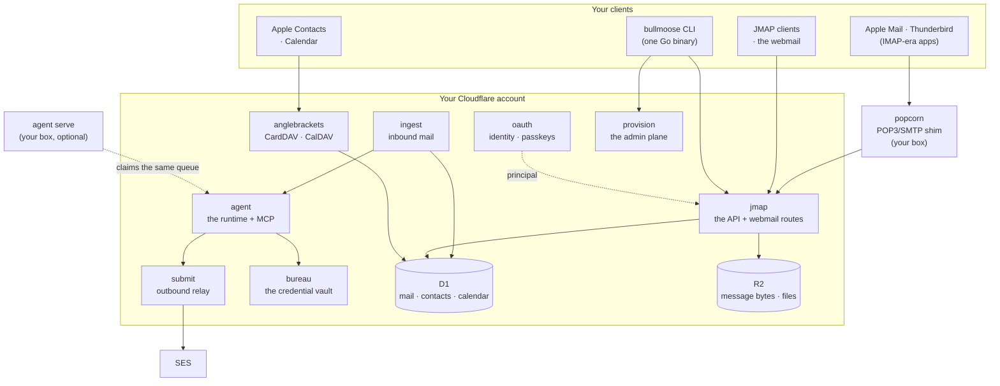
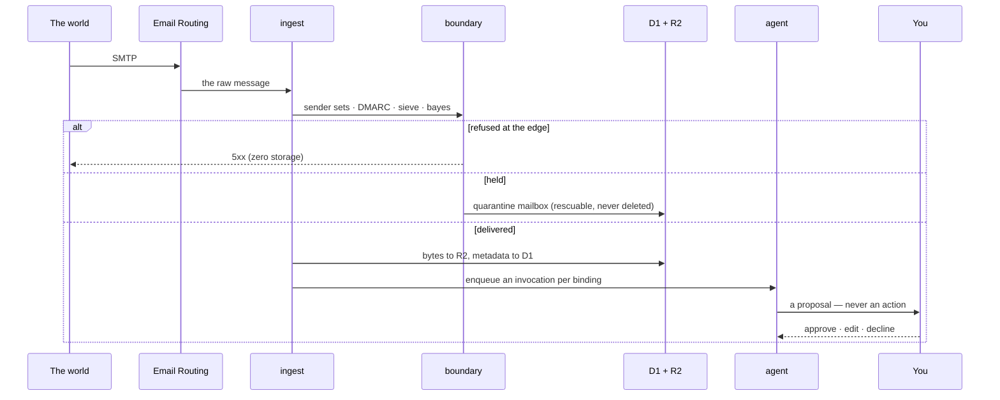

<p align="center">
  
</p>

<h1 align="center" align="center">bullmoose</h1>

<div align="center">
  <a align="center" href="https://quoteinvestigator.com/2022/12/17/what-you-can/" target="_blank">
    <p align="center">
      <em>“Do what you can,</em> <br/>
      <em>with what you’ve got, </em><br/>
      <em>from where you are.” </em><br/>
      <em>- Bill Widener (made popular by Theodore Roosevelt)</em>
    </p>
  </a>  
</div>

**bullmoose is a self-hosted personal-data platform — email, contacts,
calendar, and email-native agents — that runs serverless on
[Cloudflare's free tier](https://developers.cloudflare.com/workers/platform/pricing/).**
Your domain, your data, one core: modern clients speak JMAP, Apple devices sync over
CardDAV/CalDAV, legacy apps reach mail through a POP3/SMTP shim, and agents are
simply mailboxes with a runtime attached. A typical personal deployment costs **$0/month**
(excluding your domain costs).

<p align="center">
  <a href="#what-it-does">What it does</a> ·
  <a href="#who-its-for">Who it's for</a> ·
  <a href="#the-stack-standard-by-standard">The stack</a> ·
  <a href="#how-its-built">How it's built</a> ·
  <a href="#deploying-your-own">Deploying your own</a> ·
  <a href="#agent-backed-accounts--cloud-or-homelab">Agent-backed accounts</a> ·
  <a href="#status">Status</a>
  <br/>
  <sub><a href="docs/playbooks/README.md">Playbooks</a> ·
  <a href="docs/DEPLOY.md">Deploy checklist</a> ·
  <a href="docs/architecture/README.md">Architecture</a> ·
  <a href="docs/README.md">Cookbook</a></sub>
</p>

## What it does

- **Mail on your own domain** — a full JMAP server (RFC 8620/8621):
  send, receive, threads, search, push, drafts, vacation responses.
  Inbound arrives via [Cloudflare Email Routing](https://developers.cloudflare.com/email-routing/);
  outbound relays through [AWS SES](https://aws.amazon.com/ses/) or
  Cloudflare Email Sending — your choice of one vendor or two (see
  "Two shapes" below) — with DKIM/SPF/DMARC wired by the provisioning API.
- **Contacts and calendar as the source of truth** — JSContact
  (RFC 9553/9610) and JSCalendar (RFC 8984) stored losslessly, with a
  capped on-demand recurrence engine (DST-correct, timezone-aware) and
  CLI importers to converge your existing data in (vCard exports,
  Google Calendar).
- **Native app sync** — the `anglebrackets` worker serves CardDAV +
  CalDAV (the minimal verb subset real clients use), so Apple
  Contacts/Calendar sync against the same core your agents read. Idle
  device polls cost one row read.
- **Agents as mailboxes** — bind a runtime to an address
  (`editor@`, `analyst@`) and it replies, extracts receipts into a
  spend ledger, or runs your own pipeline; SLA watchdogs auto-respond
  if an agent goes quiet. A read-only analytics MCP gives agents safe
  tools over the message log with zero external credentials.
- **Sharing and delegation, built correctly** — cross-account grants
  (effective rights = token ∩ grant, every access audited) back both
  agent delegation and family sharing (`AddressBook.shareWith`); a
  write-only, envelope-encrypted credential vault holds third-party
  API keys and OAuth refresh tokens.
- **A real CLI** — `bullmoose`: login/autodiscovery, offline-capable
  sync to local SQLite, send (Markdown → MIME with inline images and
  big-file links), watch (live push), contacts/calendar import and
  agenda, token/grant/credential administration. Fully self-documenting —
  `bullmoose help`, `bullmoose help --json`, or the [CLI reference](docs/cli.md).

## Who it's for

- **Self-hosters** who want mail + contacts + calendar on their own
  domain without running (or trusting) a mail VPS — there are no
  servers here to patch.
- **Families** — multi-tenant schema, shared address books, per-device
  revocable app-passwords.
- **Agent builders** who want email-native agents with real tools,
  scoped delegated access, and an auditable trail — not a bot with
  your whole inbox password.
- **Protocol tinkerers** — a compact, readable implementation of the
  modern IETF personal-data stack (see the table below), e2e-tested
  against real clients and real data.

## The stack, standard by standard

| layer        | contacts                                                                                                                       | calendar                                                                                                                          | mail                                                           |
| ------------ | ------------------------------------------------------------------------------------------------------------------------------ | --------------------------------------------------------------------------------------------------------------------------------- | -------------------------------------------------------------- |
| JSON model   | [JSContact](https://jmap.io/spec/rfc9610/) — RFC 9553                                                                          | [JSCalendar](https://jmap.io/spec/calendars-draft/) — RFC 8984                                                                    | [JMAP Mail](https://jmap.io/) - RFC 8621                       |
| JMAP methods | RFC 9610                                                                                                                       | draft-ietf-jmap-calendars (pragmatic core)                                                                                        | RFC 8620/8621                                                  |
| Compat APIs  | [vCard 6350](https://datatracker.ietf.org/doc/html/rfc6350) over [CardDAV 6352](https://datatracker.ietf.org/doc/html/rfc6352) | [iCalendar 5545](https://datatracker.ietf.org/doc/html/rfc5545) over [CalDAV 4791](https://datatracker.ietf.org/doc/html/rfc4791) | POP3/SMTP via the popcorn shim                                 |
| translation  | [RFC 9555](https://datatracker.ietf.org/doc/html/rfc9555)                                                                      | JSCalendar ⇄ iCalendar                                                                                                            | [RFC 5322](https://datatracker.ietf.org/doc/html/rfc5322) MIME |

## How it's built

Five stateless [workers](https://developers.cloudflare.com/workers/) around
one stateful actor: each account has a **[Durable Object](https://developers.cloudflare.com/durable-objects/)**
owning a monotonic state sequence and a collection-agnostic changelog
— mail, contacts, calendar, and agent queues all sync through the same
commit/`/changes`/push machinery. [D1](https://www.cloudflare.com/products/d1/)
holds metadata and JSON documents; [R2](https://www.cloudflare.com/products/r2/)
holds bytes (raw messages, attachments, contact photos). Rationale, diagrams, and the free-tier
capacity story live in [`docs/architecture/`](docs/architecture/README.md).

The reusable logic lives in **ten [packages](packages/README.md)**; the six
**[services](services/README.md)** compose them into deployed workers. Both
indexes link down into each component. Around them,
[`infra/`](infra/README.md) is the bootstrap runbook, [`tools/`](tools/README.md)
the e2e suites, and `src/` the (unrelated) bullmoose.cc marketing site.

## How it fits together

Two pictures. The first is what runs; the second is what happens to a message.





## Deploying your own

Two ways in. Both end at the same place: your domain, your Cloudflare account,
your data.

### The short way — one binary, one token (recommended)

No checkout, no Node, no build, no toolchain of any kind — one static binary
and a Cloudflare API token. The CLI downloads a published, checksummed stack
and applies it to _your_ Cloudflare account over documented APIs, including the
webmail itself (uploaded to R2 and served by a worker). Nothing shells out;
there is no step at the end that hands you back to a package manager.

```sh
# 1. get the binary (docs/install-cli.md has checksums + platform notes)
curl -fsSL https://dl.bullmoose.cc/cli/latest.txt          # the current version

# 2. see EXACTLY what would happen — read-only, nothing is created
export CLOUDFLARE_API_TOKEN=…            # scopes: docs/install-cloud.md
bullmoose cloud plan    --zone example.com

# 3. the same plan, one honest yes, then apply
bullmoose cloud install --zone example.com

# 4. the receipt prints these, filled in
bullmoose admin init --url https://bullmoose-provision.<subdomain>.workers.dev --token …
bullmoose admin tenant add home
bullmoose admin domain add example.com --tenant <tenantId>   # MX + routing + DKIM
bullmoose cloud doctor  --zone example.com                   # did the mail path land?
```

`cloud plan` prints every resource by name — create / reuse / refuse — with
refusals first. The installer **never overwrites a resource it did not make**,
and a half-applied install is resumable: fix the cause, run the same command.
Everything it mints (admin token, vault key, signing keys) is generated on your
machine and lands only in your account. Full walkthrough:
[`docs/install-cloud.md`](docs/install-cloud.md).

### The long way — from source

For hacking on the platform itself — **this is the only path that needs a
toolchain.** The workers are TypeScript and wrangler is what bundles and
deploys them, so a source build needs [Node](https://nodejs.org/) 22+; that is
a maintainer's concern, not a deployer's. The short way above consumes the
artifacts this path produces, which is why it needs none of it.

Other prerequisites: a domain on a [Cloudflare](https://www.cloudflare.com/)
account and a way to send mail — Cloudflare's own Email Sending, or an
[AWS](https://aws.amazon.com/ses/) account if you would rather trade setup for
the free tier (see the two shapes below). Authenticate wrangler once with
`npx wrangler login`.

```sh
npm install && npm run typecheck

# resources → wire ids → schemas → secrets → deploy, in one idempotent pass.
# Preview everything first; drop --dry-run to execute. Re-runnable, and you
# can run a single phase, e.g. `node infra/bootstrap.mjs secrets`.
node infra/bootstrap.mjs --dry-run

ADMIN_TOKEN=$(grep -m1 '^ADMIN_TOKEN=' .env | cut -d= -f2)
bullmoose admin init --url https://bullmoose-provision.<acct>.workers.dev --token "$ADMIN_TOKEN"
bullmoose admin tenant create t_home --name "Home"
bullmoose admin domain add example.com --tenant t_home
bullmoose admin account create you@example.com --tenant t_home
bullmoose login you@example.com
```

The full checklist — SES identity verification, first-light testing, and what
each phase does under the hood — is [`docs/DEPLOY.md`](docs/DEPLOY.md).

Then: [`docs/playbooks/`](docs/playbooks/README.md) are step-by-step client
setups (Apple Mail + Calendar, a JMAP client like Mailtemi, family sharing),
[`docs/carddav-setup.md`](docs/carddav-setup.md) is the Apple Contacts/Calendar
detail, [`docs/README.md`](docs/README.md) is the use-case cookbook (agents
included), and [`tools/`](tools/README.md) holds the e2e suites everything is
verified against.

### Two shapes: pay for simplicity, or spend complexity to be frugal

Same system either way. What changes is how many vendors you answer to, and
every rung prices itself in **friction rather than dollars**.

**A · All Cloudflare.** One provider, one bill, two credentials — the whole
install fits on a page.

```sh
export CLOUDFLARE_API_TOKEN=…        # one token: Workers, D1, R2, DNS, Email Sending
bullmoose cloud plan    --zone example.com     # read-only; refusals first
bullmoose cloud install --zone example.com

# send through Cloudflare: RELAY=cloudflare in services/submit/wrangler.jsonc
npx wrangler secret put CF_EMAIL_API_TOKEN -c services/submit/wrangler.jsonc
```

Needs Workers Paid. ⚠️ The Cloudflare relay carries text and HTML; until it
carries attachments, mail with **inline images or attached files wants SES**.

**B · Very free.** The same install, then three independently optional
frugality rungs — take one, take all three.

```sh
# 1. outbound: SES free tier, byte-exact MIME (RELAY=ses is the default)
#    an IAM user scoped to ses:SendRawEmail only, DKIM CNAMEs in your zone,
#    and a production-access ticket — until it clears you are in the sandbox.
npx wrangler secret put SES_ACCESS_KEY_ID     -c services/submit/wrangler.jsonc
npx wrangler secret put SES_SECRET_ACCESS_KEY -c services/submit/wrangler.jsonc

# 2. thinking: your own models, keyless, honestly $0
bullmoose local connect --host http://localhost:11434

# 3. your box does the work — it declares what it can run, and claims for free
bullmoose agent serve --fleet ~/.bullmoose/fleet.json
```

Four credentials, two vendors, one support ticket, one machine you keep
alive — and no per-message, per-token or per-second bill. The trade shows up
three times on purpose: **the paid path is one command, the free path is a few
more.**

## Agent-backed accounts — cloud or local/homelab

An agent is an ordinary account plus a **binding**. Create the mailbox, bind a
runtime to it, and every delivery enqueues an `AgentInvocation`; `--sla` arms a
watchdog that answers if the agent goes quiet. The cloud worker and any homelab
runner claim from that **same** queue — whoever claims first wins, the watchdog
backstops both. So the account and binding are made identically; what differs is
_which runtime claims the work_.

**Cloud-backed** — the deployed `agent` worker runs the binding (ingest poke +
5-minute sweep). Persona, `defaultModel`, and `modelAliases` (Workers AI free tier,
`openrouter` — live since 2026-08-18, one key reaching any hosted model — or
`gateway` once [AI Gateway](docs/architecture/ai-surface.md) is wired) live in
the binding config, beside the budget cap (`budgets.spendPerMonth`, µUSD) the
paid drain refuses to spend past. Nothing to run:

```sh
bullmoose admin account create emily@example.com --tenant t_home --name "Editor Emily"
bullmoose admin agent bind emily@example.com --name editor --reply-mode draft \
  --config docs/examples/editor-emily.config.json
```

**Homelab-backed** — you run the runtime on your own box; it logs in as the
account, watches the queue over JMAP push, and calls a local or self-hosted
model (API keys by env _reference_, never in the file). Same account + binding,
plus a long-running serve:

```sh
bullmoose admin account create hermes@example.com --tenant t_home --name "Hermes"
bullmoose admin agent bind hermes@example.com --name hermes-responder --sla 45

# on the homelab (one static Go binary — no runtime to install):
cat > hermes.json <<'JSON'
{ "binding": "hermes-responder",
  "persona": "You are Hermes, a terse, helpful assistant.",
  "model": { "provider": "openai-compatible", "baseURL": "http://localhost:11434/v1",
             "model": "llama3.3", "apiKeyEnv": "OLLAMA_KEY" },
  "reply": { "send": false } }
JSON
bullmoose login hermes@example.com
bullmoose agent serve --fleet hermes.json      # --once drains and exits (cron-friendly)
bullmoose agent install --fleet hermes.json    # optional: survive a reboot (opt-in, prints the unit first)
```

`binding` must match the bind `--name`; `model.provider` is `mock | anthropic |
openai-compatible` (point `baseURL` at Ollama, a local gateway, anything). For a
fully custom loop that skips bindings entirely, the `watch --json` bridge in
[`docs/examples/hermes-bridge.sh`](docs/examples/hermes-bridge.sh) is the
pattern. Deeper:
[`docs/architecture/agent-integration.md`](docs/architecture/agent-integration.md).

## Where everything is

| you want to…                            | read                                                                                             |
| --------------------------------------- | ------------------------------------------------------------------------------------------------ |
| stand it up on your own domain          | [`docs/install-cloud.md`](docs/install-cloud.md) — one binary, one token                         |
| get the CLI                             | [`docs/install-cli.md`](docs/install-cli.md) · [CLI reference](docs/cli.md)                      |
| deploy from source                      | [`docs/DEPLOY.md`](docs/DEPLOY.md) · [`infra/`](infra/README.md)                                 |
| set up Apple Mail / Contacts / Calendar | [`docs/playbooks/`](docs/playbooks/README.md) · [`docs/carddav-setup.md`](docs/carddav-setup.md) |
| understand the design                   | [`docs/architecture/`](docs/architecture/README.md)                                              |
| work with agents                        | [`docs/agents/`](docs/agents/README.md) · [`docs/examples/`](docs/examples/README.md)            |
| see it used for something real          | [`docs/README.md`](docs/README.md) — the cookbook                                                |
| follow a worked example on YOUR domain  | [`docs/examples/on-your-own-domain.md`](docs/examples/on-your-own-domain.md)                     |
| check the standards claims              | [`conformance/`](conformance/README.md)                                                          |

## Status

Live and e2e-tested: the full mail surface, contacts + CardDAV,
calendar + CalDAV, grants/sharing, the credential vault, agent
pipelines, and the CLI.

Deliberately out of scope for now: calendar scheduling (iTIP/iMIP),
WebDAV LOCK/COPY/MOVE, and CRDT merge for shared collections (ETags carry v1).

Capacity headroom and the shelved scaling valves are documented in
[`docs/architecture/capacity-and-scaling.md`](docs/architecture/capacity-and-scaling.md).
