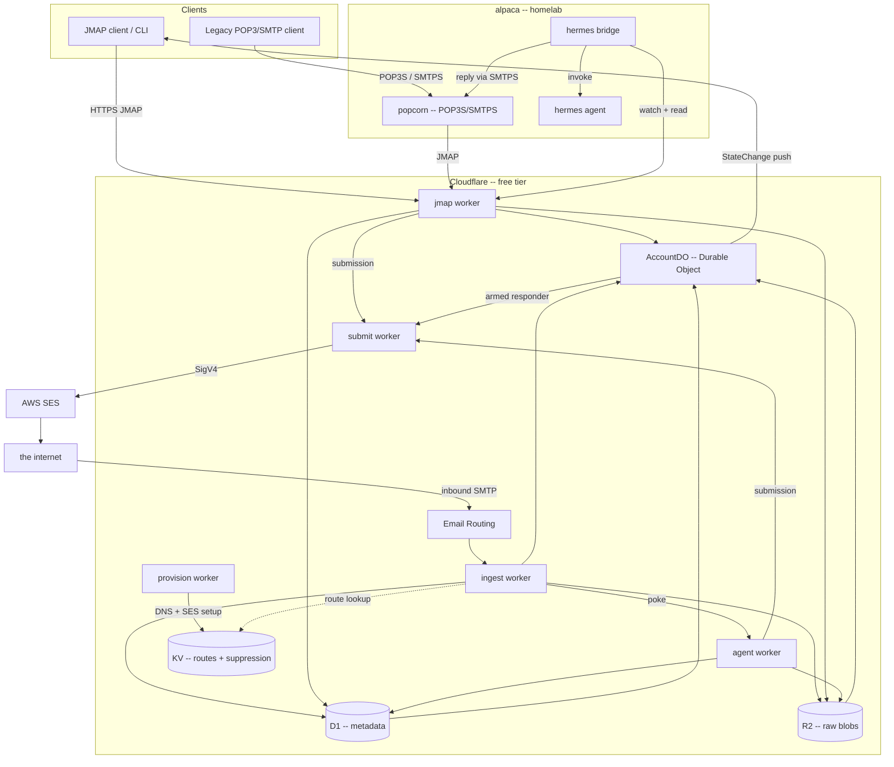
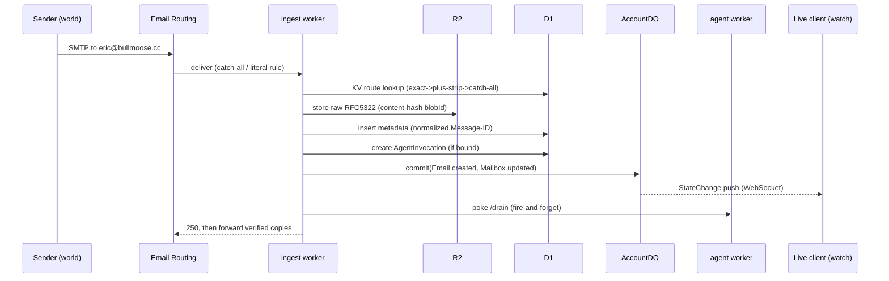
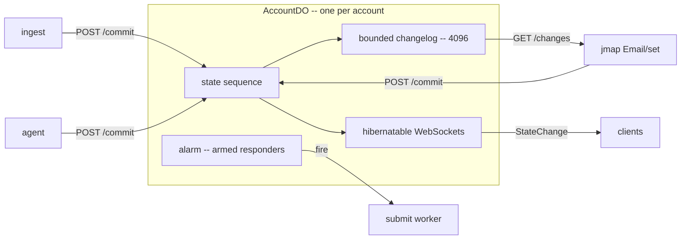
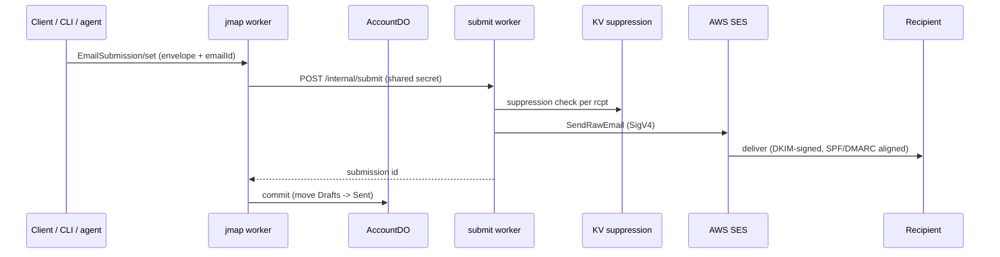
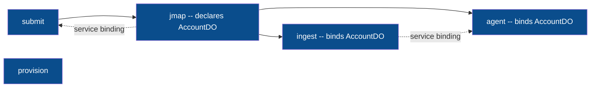
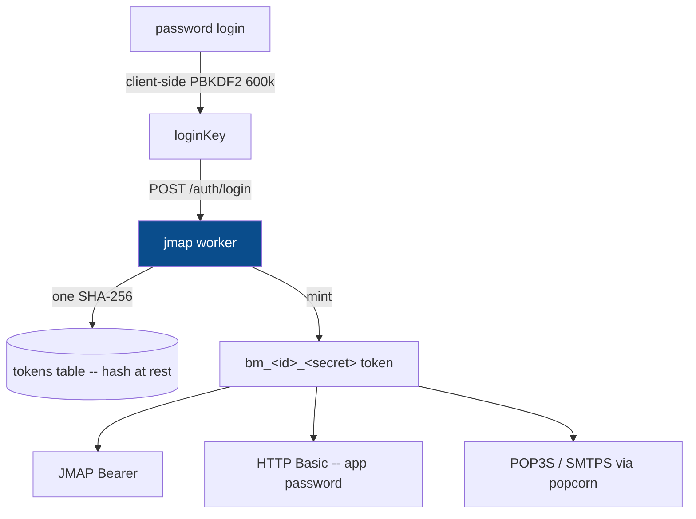
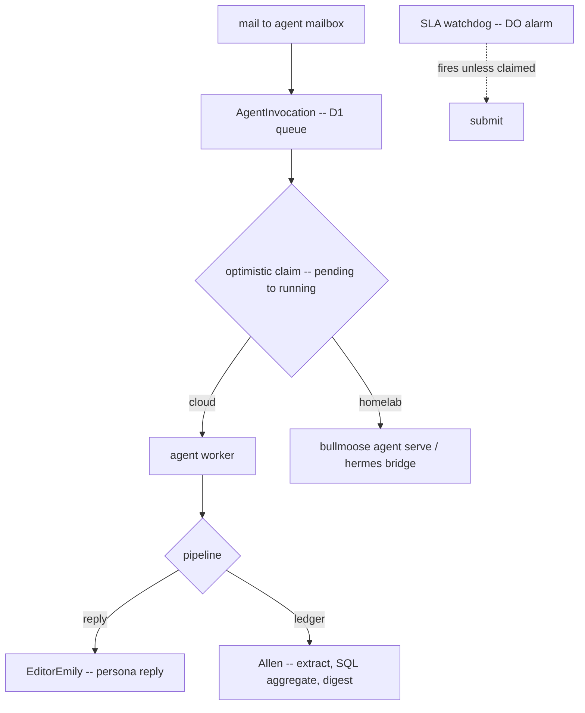
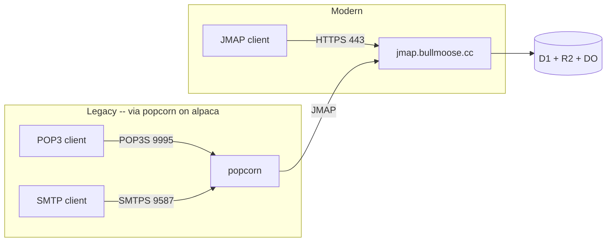
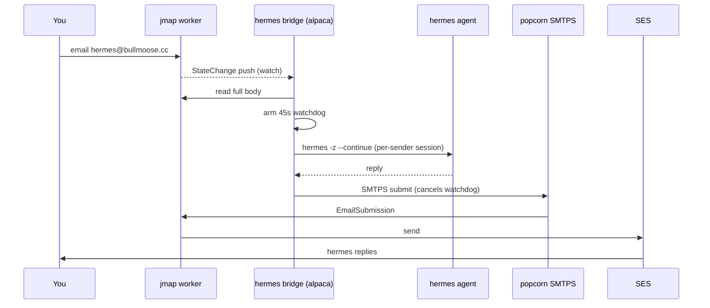

# Architecture

How bullmoose is wired, and — more importantly — **why** it's wired that
way. Deep dives live alongside this file: `serverless-jmap.md` (the core
design), `agent-integration.md` (agents), and
`capacity-and-scaling.md` (what the free tier holds, the quotas that
bind, and the shelved relief valves — blob compression and shard
rotation). This README is the map.

Forward-looking design docs — proposals, not yet built — sit here too:
`capability-roadmap.md` (the next layer), and the Cloudflare-AI evaluation
`ai-surface.md` with its companions `agents-sdk.md` (reject the framework,
cherry-pick the patterns) and `ai-search-rag.md` (opt-in retrieval,
isolation-first).

The whole system is a **serverless JMAP mail platform**: modern clients
speak JMAP directly; legacy clients reach it through a homelab protocol
shim; agents are just mailboxes with a runtime attached. State lives in
exactly one place per account, and every worker is stateless around it.

---

## 1. System topology



**Why this shape.** One rule drives everything: *state changes go through
a single writer per account (the Durable Object); everything else is
stateless and horizontally trivial.* Reads (Email/get, downloads) hit
D1/R2 directly and never touch the DO, so the single-writer bottleneck
only applies to the rare write path. The workers are deliberately small
and single-purpose because Cloudflare bills and rate-limits per worker
invocation, and because a circular service-binding graph can't deploy
(see §5).

---

## 2. Inbound: a message arriving



**Why store-then-commit-then-push, in that order.** The raw blob and the
metadata row must exist *before* the DO announces the new state, or a
client woken by the push could fetch a message that isn't queryable yet.
The forward-a-copy step (`forwardTo`) happens **last**, after delivery
succeeds, so a forwarding failure can never bounce mail we've already
accepted — the message is safe the instant it's in R2+D1.

**Why a poke *and* a cron.** The `/drain` poke gives sub-second agent
latency, but pokes can die mid-flight. The `AgentInvocation` row in D1 is
the real queue; a `*/5` cron sweep is the retry net. The row is the
truth, the poke is just an optimization — so we never need Cloudflare
Queues (a paid feature).

---

## 3. The single-writer account (Durable Object)



**Why a Durable Object at all.** JMAP's sync model needs a *monotonic
per-account state* and a changelog so clients can ask "what changed since
state X." That demands a single serialization point per account — exactly
what a Durable Object is (a single-threaded actor with storage). SQLite-
backed DOs are free-tier eligible, so we get this for $0.

**Why a bounded changelog.** Keeping every change forever is unbounded
storage; keeping the last 4096 is enough that any reasonably-live client
resyncs incrementally, and anyone further behind gets a clean
`cannotCalculateChanges` → full resync (which the spec is built for). The
DO also owns **alarms**, which is how armed responders (vacation,
watchdogs) fire without any always-on process.

---

## 4. Outbound: sending



**Why a separate submit worker with no DO binding.** Cloudflare can't
originate SMTP, so outbound must egress through a cloud relay (SES). We
isolate that in one worker holding the SES credentials. Critically, the
`jmap` worker binds `submit` as a service — so if `submit` bound the
AccountDO back, the two deployments would be **circular and un-deployable**.
Instead the callers do the state commit. The suppression list (populated
by SES bounce/complaint webhooks) is checked here, at the last hop before
send, so a suppressed address is never re-mailed regardless of caller.

---

## 5. Why the worker graph is a DAG (deploy order)



**Why order matters.** `jmap` *declares* the `AccountDO` class (owns its
migrations); `ingest` and `agent` *bind* it cross-script by name — so
`jmap` must deploy first. `jmap` binds `submit` as a service, so `submit`
deploys before `jmap`. The result is a strict dependency order
(submit → jmap → ingest → agent → provision) and a graph with **no
cycles** — the constraint that forced submit to stay DO-free in §4.

---

## 6. Authentication



**Why stretch the password on the client.** The Workers free tier caps
CPU at 10ms per request — nowhere near enough for a 600k-iteration KDF.
So the *client* runs PBKDF2 and the server only ever sees (and does one
cheap SHA-256 over) the derived key. The password never crosses the wire.

**Why tokens double as app-passwords.** Legacy clients and third-party
JMAP apps only speak username+password. A minted `bm_` token *is* that
password (HTTP Basic / POP3 PASS / SMTP AUTH), scoped and individually
revocable — so a phone gets a throwaway credential, never the real one.

---

## 7. Agents: mailboxes with a runtime



**Why the queue is just a D1 table.** An `AgentInvocation` row per
delivery, claimed with an optimistic `pending→running` UPDATE, means the
**cloud worker and a homelab runner can watch the same mailbox** and
whoever claims first wins — no coordination, no lock service. The SLA
watchdog (a DO-alarm armed responder) backstops both: if nobody claims in
time, the sender gets a "may be down" note.

**Why two runtimes.** Cloud agents (Emily, Allen) are stateless and cheap
and can't reach your homelab. hermes needs its local tools, memory, and
skills — so it runs on alpaca and is bridged in (§8). Same queue, same
guards, different muscle.

---

## 8. Client protocol coverage



**Why popcorn is a homelab shim, not a worker.** POP3 and SMTP are raw
TCP with a *server-speaks-first* greeting; Cloudflare's edge only
terminates HTTP(S)/WebSockets and waits for a request — so it can never
answer a POP3 client. popcorn (a tiny Go daemon) runs anywhere with a
real socket, holds zero state, and translates POP3/SMTP onto the same
JMAP API modern clients use. `DELE` becomes an archive move — the server
keeps every message.

---

## 9. The hermes homelab bridge



**Why compose primitives instead of a new worker.** Everything hermes@
needs already exists — `watch` (receive), `read` (body), popcorn's SMTP
(send). The bridge is glue, not infrastructure, so it stays out of the
deployed cloud and can't destabilize it. The 45s watchdog is local to the
bridge; the tradeoff is that an alpaca outage takes only hermes@ offline
while the cloud agents keep running.

---

## Cross-cutting rationale

- **Free tier as a forcing function.** The 10ms CPU cap moved key
  stretching client-side (§6); the lack of Queues made the D1 row the
  queue (§2); SQLite-backed DOs gave per-account serialization for $0
  (§3). Constraints shaped a leaner design, not a worse one.
- **One source of truth.** Every client (JMAP, POP3, SMTP, agents) reads
  and writes the same D1+R2+DO. There is no second copy to reconcile — the
  CLI's local SQLite is a cache, popcorn is stateless, agents commit back.
- **Fail-open, never lose mail.** Inbound that can't be processed is a
  temporary SMTP error (senders retry for days); forwards happen after
  durable storage; agent non-receipts forward rather than drop.
```
