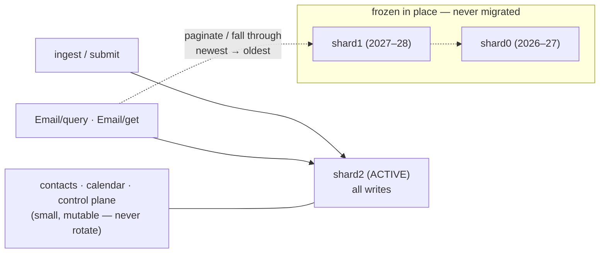

# Capacity & scaling on the Cloudflare free tier

bullmoose is designed to run a personal/family mail + contacts +
calendar platform **at $0/month**, and to grow out of $0 gracefully.
This doc records what the free tier actually holds (measured, not
guessed), which quotas bind first, the two relief valves designed but
deliberately not yet pulled, and the point where paying $5/month is
simply the right answer.

Everything here follows one storage rule: **D1 holds metadata and JSON
documents; R2 holds bytes.** Raw RFC 5322 messages, uploaded files, and
(since the photo offload) contact photos are content-hashed R2 objects.
D1 rows stay small on purpose.

## 1. The measured envelope

Real numbers from the production shard (July 2026), after photo
offload:

| collection | effective size per row |
|---|---|
| contact card (photo in R2) | ~0.7 KB |
| calendar event (recurring = ONE row, never expanded to storage) | ~0.8 KB |
| email metadata (body in R2) | ~1.2 KB with indexes |

A shard carrying 3,559 real contacts, 50 events, and mail metadata
occupies **6.8 MB of the 500 MB** free-tier database cap. Back of the
envelope for one shard: several hundred thousand contacts, a lifetime
of calendar, or ~300K messages of mail metadata — and R2's 10 GB free
holds roughly 130K raw messages beside it.

## 2. The budgets that actually bind

Storage is rarely the first wall. In order of how soon they bite:

1. **10 ms CPU per invocation** (Workers Free). Defended throughout:
   batched D1 writes instead of per-row calls, column-only fast paths
   that skip JSON blob parsing, cached VTIMEZONE generation,
   fast-forwarded recurrence expansion, and DAV polls that read one
   `ctag` row instead of listing collections. Every incident so far was
   this cap, found by running real data through prod, and fixed by
   removing O(N) work from a request.
2. **5M rows read/day.** Pooled across everything. Full-scan text
   queries read one row per stored card/event, so a 50K-card account
   gets ~100 such searches a day — while ctag polls and indexed lookups
   are effectively free. Chatty **agents are read-heavy long before
   they are storage-heavy**; bounded, indexed queries (see the
   analytics MCP) are the pattern.
3. **100K rows written/day.** Generous for mail flow; the reason bulk
   migrations are designed to never happen (see rotation below).
4. **500 MB per D1 database / 5 GB total** and **10 GB R2** — the slow
   walls this doc exists for.
5. **~100 binds per D1 query and ~2 MB per value** — hard limits already
   engineered around (chunked `IN` lists; no value larger than a few KB
   since photo offload). Local SQLite allows more of both, so only
   production testing catches violations.

## 3. Valve 1: compressing raw messages in R2 (designed, not pulled)

Raw messages compress ~2× with gzip, and Workers ship native
`CompressionStream`/`DecompressionStream` (gzip/deflate only — no
brotli without WASM). The clean design, when wanted:

- Compress only `message/rfc822` blobs at ingest/submit — never generic
  uploads (already-compressed media loses).
- `blobId` stays the sha-256 of the **raw** bytes (content addressing
  and dedup keep meaning); the stored object is gzipped and flagged in
  R2 metadata; the download handler pipes through `DecompressionStream`
  when the flag says so. Old blobs coexist uncompressed.
- FTS is unaffected: it indexes text extracted at ingest and never
  reads raw MIME.

Why it waits: R2 egress is free and storage past 10 GB costs
$0.015/GB-month, so at 200K messages compression saves about a dime a
month against real added moving parts. **Trigger: approaching the
10 GB free R2 cap while refusing to pay.**

## 4. Valve 2: shard rotation (designed, not pulled)

The schema was born multi-shard: every data-plane table is keyed by
`account_id`, and the control plane's `accounts.shard` column names the
data-plane database. Two ways to use that:

- **Account sharding** (the built-in assumption): different tenants or
  account-hash buckets on different databases. A routing concern only.
- **Time rotation** (for a single account that outgrows 500 MB at $0):

The one rule that makes rotation cheap: **rotate forward, never
migrate.** When the active shard nears full, freeze it in place (it
simply stops receiving inserts and becomes the newest archive), create
a fresh database, and point ingest at it. No rows move — which matters,
because moving 300K rows would eat days of the 100K-writes/day quota.

What rotates: the append-mostly, time-ordered tables — `emails` (+
membership/keywords/FTS), `spend_facts`, invocation logs. What never
rotates: contacts, calendars, and the control plane (mutable and tiny —
megabytes, not hundreds).

Read-path consequences, all bounded:

- **Get by id**: try the active shard, fall through newest → oldest.
  Misses are rare and each costs one indexed lookup per shard.
- **Query/pagination**: mail sorts by `receivedAt DESC`, which aligns
  with shard recency — a page that exhausts the active shard continues
  into the next archive. Time-window filters route directly.
- **Threading**: a reply whose parent lives in an archive needs a
  fall-through on the `message_id` lookup (or year-old threads restart).
- **Full-text**: per-shard FTS; fan out, or "search active, offer
  older."
- **Sync (`/changes`, ctag, push)**: untouched — the AccountDO
  changelog lives in DO storage and archives are near-immutable.
- **Plumbing**: D1 bindings are static, so each shard is a wrangler
  config entry plus a registry row; `Mailstore` already takes its
  database in the constructor, so this is a `storeFor(ctx, shard)`
  refactor, not a rewrite.

Ceiling with rotation: the free tier's **5 GB total** D1 storage ≈ ten
shards ≈ **3–4 million messages of metadata for $0**. Note what rotation
does *not* extend: the pooled 5M rows-read/day — archives even spend
extra reads on fall-through. Storage-stingy and read-chatty are
different problems; rotation only solves the first.

**Trigger: the active shard crossing ~400 MB, or a hard commitment to
$0.** At ~500 agent messages/day (~0.6 MB/day of metadata) a shard
lasts 2+ years, so the fuse is long.

## 5. When $5/month is the answer

Workers Paid dissolves every wall above at once: 10 GB per database,
vastly larger read/write allowances, and the same code — sharding
remains available on top for the truly enormous. For a personal
deployment that has grown enough to fill a database, this is almost
always the right trade. The valves exist so the choice belongs to the
operator, not the architecture.
