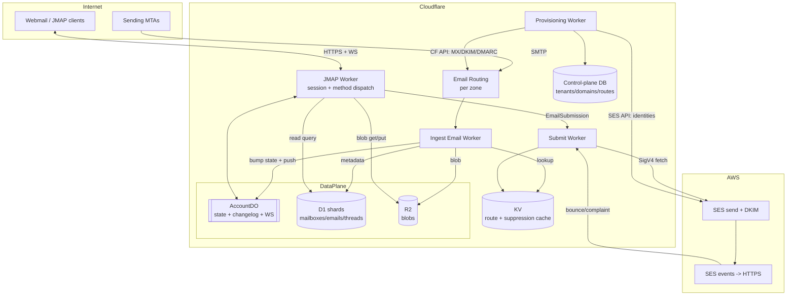

# Serverless JMAP Mail Platform — Architecture (Path A)

Status: **design / exploration**
Target: multi-domain, serverless JMAP mail server with Cloudflare core + a cloud SMTP relay (SES) for outbound.

---

## 1. Goals & non-goals

**Goals**
- A genuinely serverless JMAP (RFC 8620 core + RFC 8621 mail) server: no always-on mailstore process.
- Inbound mail via Cloudflare Email Routing / Email Workers.
- Outbound mail via a cloud relay (AWS SES primary; Postmark/Resend as pluggable alternates) — Cloudflare cannot send.
- Device sync + webmail from the same JMAP endpoint.
- **Multi-domain / multi-tenant from day one** — one deployment hosts many domains over time.

**Non-goals (for now)**
- Running our own outbound MTA / managing IP reputation (offloaded to the relay).
- Full IMAP/POP surface (optional future bridge; see §13).
- Perfect JMAP conformance on day one — build the method set the webmail needs first.

---

## 2. Key decisions & the "hard truth"

JMAP's value is **stateful, efficient sync**: a monotonic `state` string per account + `/changes` methods so clients pull deltas. That makes JMAP a *queryable, sync-able mailstore*, which pure FaaS does not give for free. Cloudflare **Durable Objects** are the reason Path A works cleanly:

- **One Durable Object per account** = a single-writer actor → the natural serialization point for the per-account `state` counter and changelog. No distributed locks.
- **DO hibernatable WebSockets** = JMAP-over-WebSocket push (RFC 8887) with no always-on server.
- **D1 (SQLite + FTS5)** = `Email/query` filter/sort + full-text search map cleanly to SQL.
- **R2** = raw-message + attachment blobs, no egress fees, range requests for partial fetch.
- **Gap:** outbound. Filled by SES via signed `fetch` from a Worker.

Two constraints that shape everything:
1. **Cloudflare cannot send outbound mail** (Email Routing is inbound/forward-only). Egress needs SES/Postmark/Resend.
2. **Native JMAP client ecosystem is thin** (Fastmail apps, `aerc`, `mujmap`). Stock Mail.app/Thunderbird/mobile speak IMAP → if that matters later, add an IMAP bridge (§13); JMAP itself serves the webmail + modern clients.

---

## 3. High-level diagram



---

## 4. Tenancy & data model

Hierarchy (multi-domain is baked into the identifiers):

```
Tenant            billing / isolation boundary (an org, or just "us")
  └─ Domain       a Cloudflare zone; belongs to one tenant
      └─ Account  a mailbox-owner / JMAP account (localpart@domain)
          ├─ Identity   from-addresses this account may send as
          ├─ Mailbox    folders (roles: inbox/sent/drafts/trash/junk/archive)
          ├─ Thread
          └─ Email      metadata; body/attachments live as Blobs in R2
```

- **AccountId is globally unique and tenant-prefixed** (`t_<tenant>__a_<acct>`), so DO names, R2 keys, and shard keys derive from it directly.
- **JMAP `Session.accounts`** is a map — one authenticated principal can hold several accounts. This is the multi-domain superpower: one login can surface `alice@a.com` **and** `alice@b.com` as sibling accounts, or keep 1 login : 1 account. Principal → accounts[] lives in the control plane.

### Address resolution / routing

Incoming `local+tag@domain` must resolve to account(s). Keep a **route table** (write master in control-plane DB, hot copy in **KV** for the ingest fast path):

```
route:{domain}:{localpart}     -> accountId          # exact mailbox
route:{domain}:*               -> accountId | drop   # catch-all
alias:{domain}:{localpart}     -> [accountId, ...]   # fan-out aliases
fwd:{domain}:{localpart}       -> [external addr]    # forward-only
```

Rules: exact match → plus-addressing strips `+tag` → alias fan-out → catch-all → reject. Plus-tag is preserved on the stored Email for filtering.

---

## 5. Components

| Worker | Responsibility |
|---|---|
| **Ingest** (Email Worker, bound to all zones) | Parse MIME, read SES/CF spam+virus verdict, resolve RCPT via KV route table, write blob→R2, insert Email row→D1 shard, notify AccountDO to bump state + push. |
| **JMAP** (HTTP + WS) | Auth the bearer token, return `Session`, dispatch the batched JMAP `Request` (method calls). Reads hit D1/R2; **mutations that bump state go through AccountDO**. Holds the WS/EventSource for push. |
| **Submit** | `EmailSubmission/set`: validate identity↔account↔domain, pull draft blob, SigV4-sign a `fetch` to SES `SendRawEmail`, move to Sent, bump state. Also the SES-event webhook sink for bounces/complaints → suppression list. |
| **Provisioning** | "Add a domain" flow: drive Cloudflare API (MX, SPF, Email Routing, DKIM/DMARC CNAMEs) + SES API (domain identity, DKIM tokens, MAIL FROM), poll verification, flip domain active. |
| **Auth** | OAuth2/OIDC token issuance/validation; app passwords for legacy clients; passkeys for webmail. |

---

## 6. State & sync (the core of JMAP)

- **AccountDO** (one per accountId) owns: the current `state` seq, a **bounded changelog** (last N states → `{created[], updated[], destroyed[]}` per collection), and the live WebSocket connections.
- **Single writer:** every mutation that changes visible state (ingest delivery, Email/set, EmailSubmission) calls the DO, which (a) increments state, (b) appends to the changelog, (c) pushes a `StateChange` to connected WS clients.
- **Reads scale around the DO:** `Email/get`, `Email/query` read D1/R2 directly; only writes + `/changes` + push funnel through the DO.
- **`/changes` semantics:** client sends `sinceState`; DO replays the changelog. If `sinceState` is older than the bounded window → return `cannotCalculateChanges` and the client does a full resync (allowed by spec). Keep the window generous (e.g. thousands of deltas) with older entries aged out of DO storage.

---

## 7. Storage layout & sharding

- **Control-plane DB** (D1 or Postgres): `tenants`, `domains`, `principals`, `accounts`, `routes`, `identities`, `provisioning_status`. Source of truth; small, low-write.
- **Data-plane D1 (sharded):** `mailboxes`, `emails`, `threads`, `keywords`, `changelog_snapshots`. D1 has a per-DB size ceiling → **shard by tenant** (or by account-hash within a big tenant). `accountId → shard` map in control plane.
- **R2 keyspace:** `s3://mail/{tenantId}/{accountId}/blobs/{blobId}` — `blobId` = content hash (dedups identical attachments per account).
- **KV:** route table hot copy + outbound suppression list (read-heavy, eventual consistency fine).

---

## 8. Multi-domain onboarding (the differentiator)

Because Cloudflare is both DNS and compute, domain onboarding is fully API-driven:

1. Operator adds `example.com` to a tenant.
2. Provisioning Worker → **Cloudflare API**: confirm zone on account, enable Email Routing, add `MX` + SPF `TXT`, add catch-all route → Ingest Worker.
3. Provisioning Worker → **SES API**: `CreateEmailIdentity(example.com)`, read the 3 DKIM tokens, set a custom MAIL FROM subdomain.
4. Back to **Cloudflare API**: add the 3 DKIM `CNAME`s, MAIL FROM `MX`+`TXT`(SPF), and a `DMARC` `TXT`.
5. Poll SES + CF verification; flip `domains.status = active`.

No human editing DNS. Adding domain #50 is the same call as domain #1.

**Outbound reputation isolation:** per-domain (or per-tenant) SES **configuration sets**; graduate hot tenants to **dedicated IP pools** when volume justifies it, so one noisy tenant can't tank another's deliverability.

---

## 9. Outbound via SES (multi-domain)

- One SES account holds many verified domain identities; DKIM per domain (auto-signed on send).
- Submit Worker signs SES calls with a **least-privilege IAM user** (`ses:SendRawEmail` only) key stored as a Worker secret, via `aws4fetch` SigV4. (STS/role assumption isn't native to Workers.)
- Envelope MAIL FROM set per sending domain; identity ownership checked against the account before send.
- Bounces/complaints: SES config set → SNS/HTTPS → Submit Worker → suppression list in KV + Email state update. Respect suppression before every send.
- **Adapter interface** (`OutboundRelay`) so SES can be swapped for Postmark/Resend per tenant without touching JMAP code.

---

## 10. Auth

- OAuth2/OIDC bearer tokens on the JMAP endpoint; `tenantId` + `principalId` in claims.
- **App passwords** for any legacy/IMAP-bridge clients.
- **Passkeys/WebAuthn** for webmail login.
- Token → principal → `accounts[]` resolution in the control plane feeds `Session.accounts`.

---

## 11. Contacts & Calendars — does JMAP cover CardDAV/CalDAV?

**Yes — JMAP is a general protocol, and contacts/calendars are first-class extensions on top of the same core, session, auth, and push machinery.** That's a real advantage over stitching together separate CardDAV + CalDAV servers.

| Capability | JMAP spec | Underlying object format | Maturity |
|---|---|---|---|
| Mail | RFC 8621 | RFC 5322 / MIME | Standard (stable) |
| **Contacts** (CardDAV-equivalent) | **RFC 9610 — JMAP for Contacts** | **JSContact (RFC 9553)** | Standards-track RFC |
| **Calendars** (CalDAV-equivalent) | **draft-ietf-jmap-calendars** | **JSCalendar (RFC 8984)** | IETF draft (near-final, not yet a numbered RFC) |
| WebSocket push | RFC 8887 | — | Standard |

Notes:
- JSContact/JSCalendar are **JSON** models — no vCard/iCalendar text parsing, which is a large simplification vs DAV.
- One JMAP `Session` can expose Mail **and** Contacts **and** Calendars accounts in the same `accounts` map, shared auth + one push channel.
- **Caveat:** client support is even thinner than for mail (Fastmail is the main real-world implementer). Interop with existing CardDAV/CalDAV clients (Apple/Google/Thunderbird address books & calendars) would need a **DAV bridge** that translates JSContact↔vCard and JSCalendar↔iCalendar. So JMAP *defines* the functionality; reaching stock DAV clients is a bridge problem, same shape as the IMAP question.
- **Recommendation:** ship Mail first. The DO/D1/R2/state-sync spine here is reusable almost verbatim for Contacts and Calendars later (same changelog + push model, different object schema). Treat them as Phase 4/5.

---

## 12. Repo structure (monorepo)

```
/infra              # Wrangler config, D1/R2/KV/DO bindings, env per stage
/services
  /jmap             # JMAP HTTP + WS worker (session + method dispatch)
  /ingest           # inbound Email Worker
  /submit           # outbound send + bounce/complaint sink
  /provision        # multi-domain onboarding (CF API + SES API)
  /auth             # OAuth/OIDC, app passwords, passkeys
/packages
  /jmap-core        # shared JMAP types + method-dispatch framework + errors
  /mailstore        # data-access over D1 + R2 (+ shard resolver)
  /account-do       # AccountDO: state, changelog, push
  /mime             # MIME parse + build
  /outbound         # OutboundRelay adapter (SES | Postmark | Resend)
/webmail            # SPA JMAP client (reuse existing Preact/Fresh stack)
/www                # existing bullmoose.cc marketing site (keep or split)
```

---

## 13. Phased roadmap

1. **MVP (single tenant, single domain, one account):** ingest→R2/D1, minimal JMAP (`Session`, `Mailbox/get`, `Email/query`+`get`, `EmailSubmission/set`), webmail read+send, **poll** for changes.
2. **Real sync:** AccountDO + `state`/`/changes`, then WS push.
3. **Multi-domain + multi-tenant:** control plane, route table/KV, provisioning automation, per-domain SES identities + suppression.
4. **Hardening:** auth (OIDC/passkeys/app-passwords), spam/virus policy, search polish, quotas.
5. **Reach:** JMAP Contacts (RFC 9610) + Calendars (draft); optional IMAP bridge and CardDAV/CalDAV bridge for stock clients.

---

## 14. Open questions / risks

- **D1 limits** at scale (size, write throughput) — sharding strategy and possible migration to Postgres (Neon/Aurora Serverless v2) for very large tenants.
- **DO changelog window** vs storage cost — how many states before `cannotCalculateChanges`.
- **SES production access + sandbox** — request early; per-domain warmup.
- **Secrets** — IAM key in Worker secret is the pragmatic choice; rotate; scope to `ses:SendRawEmail`.
- **Spam/AV** — CF/SES verdicts are basic; may need a scanning step (e.g. Rspamd via a container) for a serious deployment.
- **Client ecosystem** — thin native JMAP support; webmail is the primary client; bridges are the answer for stock apps.
