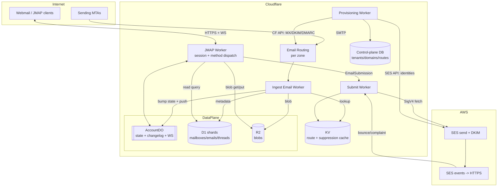

# Serverless JMAP Mail Platform — Architecture (Path A)

Status: **design / exploration**
Target: multi-domain, serverless JMAP mail server with Cloudflare core + a cloud SMTP relay (SES) for outbound.

---

## 1. Goals & non-goals

**Goals**
- A genuinely serverless JMAP (RFC 8620 core + RFC 8621 mail) server: no always-on mailstore process.
- Inbound mail via Cloudflare Email Routing / Email Workers.
- Outbound mail via a cloud relay (AWS SES primary; Postmark/Resend as pluggable alternates) — Cloudflare cannot send.
- Device sync + webmail from the same JMAP endpoint.
- **Multi-domain / multi-tenant from day one** — one deployment hosts many domains over time.

**Non-goals (for now)**
- Running our own outbound MTA / managing IP reputation (offloaded to the relay).
- Full IMAP/POP surface (optional future bridge; see §13).
- Perfect JMAP conformance on day one — build the method set the webmail needs first.

---

## 2. Key decisions & the "hard truth"

JMAP's value is **stateful, efficient sync**: a monotonic `state` string per account + `/changes` methods so clients pull deltas. That makes JMAP a *queryable, sync-able mailstore*, which pure FaaS does not give for free. Cloudflare **Durable Objects** are the reason Path A works cleanly:

- **One Durable Object per account** = a single-writer actor → the natural serialization point for the per-account `state` counter and changelog. No distributed locks.
- **DO hibernatable WebSockets** = JMAP-over-WebSocket push (RFC 8887) with no always-on server.
- **D1 (SQLite + FTS5)** = `Email/query` filter/sort + full-text search map cleanly to SQL.
- **R2** = raw-message + attachment blobs, no egress fees, range requests for partial fetch.
- **Gap:** outbound. Filled by SES via signed `fetch` from a Worker.

Two constraints that shape everything:
1. **Cloudflare cannot send outbound mail** (Email Routing is inbound/forward-only). Egress needs SES/Postmark/Resend.
2. **Native JMAP client ecosystem is thin** (Fastmail apps, `aerc`, `mujmap`). Stock Mail.app/Thunderbird/mobile speak IMAP → if that matters later, add an IMAP bridge (§13); JMAP itself serves the webmail + modern clients.

---

## 3. High-level diagram



---

## 4. Tenancy & data model

Hierarchy (multi-domain is baked into the identifiers):

```
Tenant            billing / isolation boundary (an org, or just "us")
  └─ Domain       a Cloudflare zone; belongs to one tenant
      └─ Account  a mailbox-owner / JMAP account (localpart@domain)
          ├─ Identity   from-addresses this account may send as
          ├─ Mailbox    folders (roles: inbox/sent/drafts/trash/junk/archive)
          ├─ Thread
          └─ Email      metadata; body/attachments live as Blobs in R2
```

- **AccountId is globally unique and tenant-prefixed** (`t_<tenant>__a_<acct>`), so DO names, R2 keys, and shard keys derive from it directly.
- **JMAP `Session.accounts`** is a map — one authenticated principal can hold several accounts. This is the multi-domain superpower: one login can surface `alice@a.com` **and** `alice@b.com` as sibling accounts, or keep 1 login : 1 account. Principal → accounts[] lives in the control plane.

### Address resolution / routing

Incoming `local+tag@domain` must resolve to account(s). Keep a **route table** (write master in control-plane DB, hot copy in **KV** for the ingest fast path):

```
route:{domain}:{localpart}     -> accountId          # exact mailbox
route:{domain}:*               -> accountId | drop   # catch-all
alias:{domain}:{localpart}     -> [accountId, ...]   # fan-out aliases
fwd:{domain}:{localpart}       -> [external addr]    # forward-only
```

Rules: exact match → plus-addressing strips `+tag` → alias fan-out → catch-all → reject. Plus-tag is preserved on the stored Email for filtering.

---

## 5. Components

| Worker | Responsibility |
|---|---|
| **Ingest** (Email Worker, bound to all zones) | Parse MIME, read SES/CF spam+virus verdict, resolve RCPT via KV route table, write blob→R2, insert Email row→D1 shard, notify AccountDO to bump state + push. |
| **JMAP** (HTTP + WS) | Auth the bearer token, return `Session`, dispatch the batched JMAP `Request` (method calls). Reads hit D1/R2; **mutations that bump state go through AccountDO**. Holds the WS/EventSource for push. |
| **Submit** | `EmailSubmission/set`: validate identity↔account↔domain, pull draft blob, SigV4-sign a `fetch` to SES `SendRawEmail`, move to Sent, bump state. Also the SES-event webhook sink for bounces/complaints → suppression list. |
| **Provisioning** | "Add a domain" flow: drive Cloudflare API (MX, SPF, Email Routing, DKIM/DMARC CNAMEs) + SES API (domain identity, DKIM tokens, MAIL FROM), poll verification, flip domain active. |
| **Auth** | OAuth2/OIDC token issuance/validation; app passwords for legacy clients; passkeys for webmail. |

---

## 6. State & sync (the core of JMAP)

- **AccountDO** (one per accountId) owns: the current `state` seq, a **bounded changelog** (last N states → `{created[], updated[], destroyed[]}` per collection), and the live WebSocket connections.
- **Single writer:** every mutation that changes visible state (ingest delivery, Email/set, EmailSubmission) calls the DO, which (a) increments state, (b) appends to the changelog, (c) pushes a `StateChange` to connected WS clients.
- **Reads scale around the DO:** `Email/get`, `Email/query` read D1/R2 directly; only writes + `/changes` + push funnel through the DO.
- **`/changes` semantics:** client sends `sinceState`; DO replays the changelog. If `sinceState` is older than the bounded window → return `cannotCalculateChanges` and the client does a full resync (allowed by spec). Keep the window generous (e.g. thousands of deltas) with older entries aged out of DO storage.

---

## 7. Storage layout & sharding

- **Control-plane DB** (D1 or Postgres): `tenants`, `domains`, `principals`, `accounts`, `routes`, `identities`, `provisioning_status`. Source of truth; small, low-write.
- **Data-plane D1 (sharded):** `mailboxes`, `emails`, `threads`, `keywords`, `changelog_snapshots`. D1 has a per-DB size ceiling → **shard by tenant** (or by account-hash within a big tenant). `accountId → shard` map in control plane.
- **R2 keyspace:** `s3://mail/{tenantId}/{accountId}/blobs/{blobId}` — `blobId` = content hash (dedups identical attachments per account).
- **KV:** route table hot copy + outbound suppression list (read-heavy, eventual consistency fine).

---

## 8. Multi-domain onboarding (the differentiator)

Because Cloudflare is both DNS and compute, domain onboarding is fully API-driven:

1. Operator adds `example.com` to a tenant.
2. Provisioning Worker → **Cloudflare API**: confirm zone on account, enable Email Routing, add `MX` + SPF `TXT`, add catch-all route → Ingest Worker.
3. Provisioning Worker → **SES API**: `CreateEmailIdentity(example.com)`, read the 3 DKIM tokens, set a custom MAIL FROM subdomain.
4. Back to **Cloudflare API**: add the 3 DKIM `CNAME`s, MAIL FROM `MX`+`TXT`(SPF), and a `DMARC` `TXT`.
5. Poll SES + CF verification; flip `domains.status = active`.

No human editing DNS. Adding domain #50 is the same call as domain #1.

**Outbound reputation isolation:** per-domain (or per-tenant) SES **configuration sets**; graduate hot tenants to **dedicated IP pools** when volume justifies it, so one noisy tenant can't tank another's deliverability.

---

## 9. Outbound via SES (multi-domain)

- One SES account holds many verified domain identities; DKIM per domain (auto-signed on send).
- Submit Worker signs SES calls with a **least-privilege IAM user** (`ses:SendRawEmail` only) key stored as a Worker secret, via `aws4fetch` SigV4. (STS/role assumption isn't native to Workers.)
- Envelope MAIL FROM set per sending domain; identity ownership checked against the account before send.
- Bounces/complaints: SES config set → SNS/HTTPS → Submit Worker → suppression list in KV + Email state update. Respect suppression before every send.
- **Adapter interface** (`OutboundRelay`) so SES can be swapped for Postmark/Resend per tenant without touching JMAP code.

---

## 10. Auth

- OAuth2/OIDC bearer tokens on the JMAP endpoint; `tenantId` + `principalId` in claims.
- **App passwords** for any legacy/IMAP-bridge clients.
- **Passkeys/WebAuthn** for webmail login.
- Token → principal → `accounts[]` resolution in the control plane feeds `Session.accounts`.

---

## 11. Contacts & Calendars — does JMAP cover CardDAV/CalDAV?

**Yes — JMAP is a general protocol, and contacts/calendars are first-class extensions on top of the same core, session, auth, and push machinery.** That's a real advantage over stitching together separate CardDAV + CalDAV servers.

| Capability | JMAP spec | Underlying object format | Maturity |
|---|---|---|---|
| Mail | RFC 8621 | RFC 5322 / MIME | Standard (stable) |
| **Contacts** (CardDAV-equivalent) | **RFC 9610 — JMAP for Contacts** | **JSContact (RFC 9553)** | Standards-track RFC |
| **Calendars** (CalDAV-equivalent) | **draft-ietf-jmap-calendars** | **JSCalendar (RFC 8984)** | IETF draft (near-final, not yet a numbered RFC) |
| WebSocket push | RFC 8887 | — | Standard |

Notes:
- JSContact/JSCalendar are **JSON** models — no vCard/iCalendar text parsing, which is a large simplification vs DAV.
- One JMAP `Session` can expose Mail **and** Contacts **and** Calendars accounts in the same `accounts` map, shared auth + one push channel.
- **Caveat:** client support is even thinner than for mail (Fastmail is the main real-world implementer). Interop with existing CardDAV/CalDAV clients (Apple/Google/Thunderbird address books & calendars) would need a **DAV bridge** that translates JSContact↔vCard and JSCalendar↔iCalendar. So JMAP *defines* the functionality; reaching stock DAV clients is a bridge problem, same shape as the IMAP question.
- **Recommendation:** ship Mail first. The DO/D1/R2/state-sync spine here is reusable almost verbatim for Contacts and Calendars later (same changelog + push model, different object schema). Treat them as Phase 4/5.

---

## 12. Repo structure (monorepo)

```
/infra              # Wrangler config, D1/R2/KV/DO bindings, env per stage
/services
  /jmap             # JMAP HTTP + WS worker (session + method dispatch)
  /ingest           # inbound Email Worker
  /submit           # outbound send + bounce/complaint sink
  /provision        # multi-domain onboarding (CF API + SES API)
  /auth             # OAuth/OIDC, app passwords, passkeys
/packages
  /jmap-core        # shared JMAP types + method-dispatch framework + errors
  /mailstore        # data-access over D1 + R2 (+ shard resolver)
  /account-do       # AccountDO: state, changelog, push
  /mime             # MIME parse + build
  /outbound         # OutboundRelay adapter (SES | Postmark | Resend)
/webmail            # SPA JMAP client (reuse existing Preact/Fresh stack)
/www                # existing bullmoose.cc marketing site (keep or split)
```

---

## 13. Phased roadmap

1. **MVP (single tenant, single domain, one account):** ingest→R2/D1, minimal JMAP (`Session`, `Mailbox/get`, `Email/query`+`get`, `EmailSubmission/set`), webmail read+send, **poll** for changes. To also drive a real third-party CLI (himalaya) day one, extend this set per the compatibility target in §15.
2. **Real sync:** AccountDO + `state`/`/changes`, then WS push.
3. **Multi-domain + multi-tenant:** control plane, route table/KV, provisioning automation, per-domain SES identities + suppression.
4. **Hardening:** auth (OIDC/passkeys/app-passwords), spam/virus policy, search polish, quotas.
5. **Reach:** JMAP Contacts (RFC 9610) + Calendars (draft); optional IMAP bridge and CardDAV/CalDAV bridge for stock clients.

---

## 14. Open questions / risks

- **D1 limits** at scale (size, write throughput) — sharding strategy and possible migration to Postgres (Neon/Aurora Serverless v2) for very large tenants.
- **DO changelog window** vs storage cost — how many states before `cannotCalculateChanges`.
- **SES production access + sandbox** — request early; per-domain warmup.
- **Secrets** — IAM key in Worker secret is the pragmatic choice; rotate; scope to `ses:SendRawEmail`.
- **Spam/AV** — CF/SES verdicts are basic; may need a scanning step (e.g. Rspamd via a container) for a serious deployment.
- **Client ecosystem** — thin native JMAP support; webmail is the primary client; bridges are the answer for stock apps.

---

## 15. Client compatibility target — himalaya (and the hermes agent skill)

For agents to act on mail, the interface is **not** a TUI (aerc, meli) driven over a pty — it's a client that speaks the JMAP contract directly. [himalaya](https://github.com/pimalaya/himalaya) is the fit: CLI-first, emits `--output json`, and it is already the **bundled email skill for the Nous Hermes agent**, which runs it as a terminal-command skill *outside* Hermes' built-in messaging gateway (the gateway is not an extension point). So the agent path is: **hermes → himalaya (skill) → JMAP → bullmoose.cc**. himalaya's JMAP client (`io-jmap` + `io-email`) is a near-complete RFC 8620/8621 implementation with conformance tests against Stalwart and Fastmail — treat those tests as our acceptance target. The compat work is on **our server**, not the client.

**Session structural requirements (must ship even in MVP):** the client parses capabilities leniently (`BTreeMap<String, Value>` — advertising only `core` + `mail` will *not* break session parse; a method call against an unadvertised capability returns `unknownCapability`). But `api_url`, `upload_url`, and `download_url` are **required non-optional** fields and must be valid URI templates, alongside `accounts` and `primaryAccounts`.

**What himalaya actually drives (verified against `io-email/src/*/jmap/`):**

| himalaya op | JMAP methods issued |
|---|---|
| list folders | `Mailbox/get` **+ `Mailbox/query`** |
| list / search mail | `Email/query` + `Email/get` |
| read body / attachments | `Email/get` (bodyValues) + **Blob download** |
| flag / move / delete | `Email/set` (`keywords`, `mailboxIds`, `destroy`) |
| **send** | **`Blob/upload` → `Email/import` into a `role=drafts`/`$draft` mailbox → `EmailSubmission/set`** against an `Identity` resolved via **`Identity/get`** |
| watch / incremental | `Email/changes`, `Mailbox/changes`, `Email/queryChanges` |
| niche (skip initially) | `Thread/get`, `Email/copy`, `Email/parse`, `VacationResponse/*` |

**Punch list — delta from the §13 MVP method set** (needed for read + triage + send):

1. **`Mailbox/query`** — himalaya enumerates folders via query, not just `get`.
2. **`Email/set`** — flags/move/delete (pulled forward from Phase 2; needed day one for triage).
3. **`Identity/get`** + at least one seeded `Identity` — the send path resolves `identity_id` first.
4. **`Blob/upload` endpoint + `Email/import`** — the big one: himalaya does **not** send by creating a draft via `Email/set`. It uploads raw MIME, `Email/import`s it into drafts with `$draft`, then submits. An `EmailSubmission/set`-only MVP is insufficient.
5. **Mailbox roles** — a `drafts` mailbox (import target) and `trash` (delete target) must exist with proper `role`.

`Email/changes` et al. map onto the Phase-2 AccountDO `/changes` and are not needed for read+triage+send.

**Note:** himalaya cannot author server rules over JMAP — `io-jmap` exposes only `identity`, `mailbox`, `email_submission`, `vacation_response`, `thread`, `email` (caps `core / mail / submission / vacationresponse`). Rule/policy authoring (§17) is a webmail / own-API / agent job.

**Escape hatch:** if the `Email/import` + `Identity` send semantics prove costly, a thin bespoke CLI (text/MD → bash pipe → JSON → JMAP) can target only the lean MVP methods (draft via `Email/set`), at the cost of owning a client and re-implementing attachments/search/threading/auth ourselves. Prefer himalaya; keep this as fallback.

---

## 16. Mailbox membership model — set-valued, not location

JMAP is IMAP-family, **not POP3**: the server holds the authoritative copy; a client keeps a *subordinate, disposable* cache kept coherent via `state` + `/changes`. It can always resync from scratch; the server never depends on a client existing.

Within an account, membership is the **Gmail-labels model, not folders-as-location**: an `Email` is **one object** whose `mailboxIds` is a **set**. This shapes the schema — emails ↔ mailboxes is **many-to-many** (a join table or a `mailboxIds` set), *not* a single `folder` column.

| Operation | Mechanism (verified in `io-email/src/message/jmap/`) |
|---|---|
| **move** | `Email/set` mutating the set — remove `sourceId`, add `destId` |
| **copy (within account)** | `Email/set` **adding** a `mailboxId` — still one object, now in two mailboxes; **no second message** |
| **delete** | `Email/set { destroy }` — **global delete across all mailboxes at once**. Removing from a single folder is a move (drop the id / move to Trash), *not* `destroy` |
| **copy across accounts** | the separate `Email/copy` method — the only real object duplication |

`destroy` must purge across every membership. Retrofitting folder-as-location into label-as-membership later is painful — bake the many-to-many in now.

**Search locality.** `Email/query` is **server-side**: the server evaluates the filter (including full-text `text`/`subject`/`body` conditions) and sort. This is why the D1 + FTS5 index is load-bearing. himalaya specifically is **server-first hybrid** (`envelope/jmap/search.rs`): it translates the query to a JMAP filter (`AND/OR/NOT` → `JmapFilterOperator`s), runs it server-side, then applies a small residual client-side `PostFilter` for predicates JMAP can't express (and paginates client-side only when a post-filter is present). It keeps **no persistent local corpus** — local-index search is only its notmuch/maildir backends (or a mujmap→notmuch mirror). **Consequence:** our `Email/query` filter coverage *is* the agent's search quality — thin filter support forces himalaya to over-fetch and filter client-side (slow, more egress). Implement a rich `text` full-text condition over FTS5 to keep the residue near-empty.

---

## 17. Delivery-time rules & policies engine

Rules run **server-side, at delivery** — never in a client. A client-side sweep (cron polling + `Email/set`) only fires when that client is online, is racy across clients, and duplicates logic. "Always" requires the rule to run where mail lands, whether or not anyone is connected. **Split:** the client *authors/validates* rules; the server *owns, compiles, and executes* them. Standard shape is Sieve (RFC 5228) for execution + JMAP-for-Sieve (`SieveScript/*`) for management; `VacationResponse` is the one built-in auto-rule JMAP standardizes (and himalaya supports it).

**Home: the Ingest Worker** — it already resolves RCPT and decides the landing mailbox, so rule evaluation is one inserted step:

```
Ingest:  parse MIME
      →  resolve RCPT (route table / KV)
      →  ▶ evaluate tenant policies, then user rules ◀   → target mailboxIds / keywords
      →  blob → R2
      →  Email row → D1  (mailboxIds = rule result, else [Inbox])
      →  AccountDO: bump state + push
```

- **Storage & sync:** the ruleset is **another synced, versioned collection** — its own `state` + `/changes` and optimistic concurrency (`ifInState`) so webmail + agent + CLI editors don't clobber each other. Start with a JSON ruleset in D1/control-plane; graduate to Sieve if/when a ManageSieve story is wanted.
- **User rules vs tenant policies** (distinct scopes): **user rules** ("from X → Y") are end-user-authored, per-account. **Tenant policies** (quarantine, DLP, retention, forced malware quarantine) are **admin-scoped**, live in the control plane, evaluate **before** user rules, and are **not** CRUD-able by an end-user client.
- **Apply-to-existing** ("run this rule on mail already in my inbox") is *not* a delivery rule — it's a batch `Email/query` + `Email/set` sweep (a server-side job), kept separate from the always-on delivery path.
- **Rules vs the agent:** deterministic routing → ingest rules (don't burn an agent on it). Judgment ("is this important? draft a reply?") → the hermes agent. Making the agent a polling cron that moves mail is the client-side anti-pattern above.

---

## 18. AI classification — classify-then-route

Taxonomy classification (e.g. a bucket tree `SPAM | NOTSPAM:[Marketing, Newsletter, Family:[Close, Extended], CollegeFriends, Business Opportunities, …]`) does **not** happen inside Sieve. Sieve is a deterministic, sandboxed router with no model-call primitive, kept that way on purpose. The precedent is `spamtest`/`virustest` (RFC 5235): a scanner runs first and writes a score, and Sieve routes on that score. The AI classifier is the same shape.

> **AI = perception** (emits a label + confidence). **Rules/Sieve = policy** (decides what to do with it).

**Home: a classify stage in the Ingest Worker**, feeding the §17 rule engine:

```
Ingest:  parse MIME → resolve RCPT
      →  spam gate         ← cheap/deterministic (CF/SES verdict, Rspamd)
      →  ▶ AI classify ◀   ← bucket tree → { bucket: "Family/CloseFamily", confidence: 0.86 }
      →  stamp result      ← keyword `$bucket/Family/CloseFamily` (or X-Bucket header + score)
      →  rules route on { bucket, confidence } → mailboxIds
      →  R2/D1, AccountDO bump state + push
```

Design calls:

- **Keep the spam gate cheap and separate.** Don't spend an LLM call to catch spam (adversarial, high-volume); let deterministic scanners drop it, and reserve the LLM for the **nuanced ham taxonomy**.
- **Async, don't block delivery.** An LLM on the hot path adds latency + a failure mode. Prefer: deliver fast (Inbox or a `pending` state) → enqueue a classification job (Cloudflare Queues / DO) → classify off-path → `Email/set` to move into the bucket (bumps state, pushes the move). Or hold in a staging state until classified, at the cost of per-message latency.
- **Inference:** Workers AI (in-region text classifier) or an external LLM via `fetch` (e.g. Claude for subtle buckets). A prompt-based classifier with the taxonomy in-prompt is the pragmatic start — evolve the tree by editing a prompt, not retraining.
- **Confidence lives in the rule, not the classifier.** Low-confidence mail stays in Inbox / a `Needs Review` bucket rather than being silently auto-filed. The user's rule decides trust per bucket: `if bucket=Newsletter and confidence>0.85 → Newsletter, mark read; else leave in Inbox`. AI proposes; policy disposes.
- **Feedback loop (hermes):** low-confidence/ambiguous → route to the agent for a judgment call; a human/agent moving a message *out* of a bucket is a labeled example — feed it back as few-shot context (or fine-tune data later). The agent can also *propose taxonomy edits*.

---

## 19. Feature layer — mapping product features to architectural homes

Rich-client product features (the HEY.com set is a good stress test) collapse into **five homes**. Placing a feature is a matter of identifying which home it needs; the architecture already has every primitive — features add **stages and objects**, not subsystems (with one exception, below).

| Home | Primitive | Example features |
|---|---|---|
| **A. Ingest pipeline** | delivery-time rule/classify step keyed on per-account lists | Screener (first-contact hold + allow/block list), Speakeasy/bypass code, Imbox/Feed/Paper-Trail sorting, **Mute/Exit thread** (per-account muted-`threadId` set), spy-pixel stripping, group addresses, autoresponder |
| **B. Per-account overlay data** (synced via JMAP) | **keyword** (boolean) *or* **custom vendor object** (structured) | Reply Later / Set Aside (`$replylater`/`$setaside` keywords), **Thread/Inbox/Contact Notes** + renamed subjects + clips/snippets/workflows (custom `Note/*` object under `urn:bullmoose:params:jmap:notes`) |
| **C. AccountDO alarms** | DO alarm → mutate + bump state + push | **Bubble Up / snooze** (resurface at T), Send Later, timed autoresponder |
| **D. R2 + link/download Worker** | R2 object + expiring signed URL | **Big Files** (Submit rewrites outbound MIME to a download link; a download Worker streams from R2 with range support), Attachment Library (per-account query over the blob index) |
| **E. Server-side query / aggregation** | `Email/query` + maintained counters | **Bundles / Dominators** (group by sender via query or per-sender DO counters; "bundle" writes a per-sender ingest rule), Focus & Reply (`Email/query` on `$replylater`), Feed rendering |

Already covered elsewhere: Multi-Account Linking → `Session.accounts` (§4); Send As / Extensions → Identity + routing (§4); Calendar → §11; 2FA → §10.

**Cross-cutting heuristic — keyword vs. custom capability = the client-support boundary.**
- **Boolean state → JMAP keyword.** Rides the standard rails (`Email/set` + `state`/`/changes`), syncs for free, and **shows up in himalaya as a flag**. Prefer this whenever the feature is a boolean.
- **Structured data → custom vendor capability** (`urn:bullmoose:...` + custom method namespace). Richer, but **only clients that speak it** (our webmail + the hermes agent) see it — *not* himalaya.

So: express as a keyword when boolean, reach for a custom capability only when it carries structure, and treat custom as webmail/agent-only.

**The one genuine new subsystem: collaboration / ACL.** Shared Threads, Private Comments, Collections, and Sharable Links are **not** overlay data — they need *multi-principal access control*: a sharing/grant table in the control plane, ACL checks in the JMAP method layer, and a public-link Worker with scoped tokens. HEY's "Private Comments" looks like Thread Notes but is fundamentally different (single-principal overlay vs multi-principal ACL'd data). Treat this as its own Phase-6 "teams" epic, not a per-account overlay.
