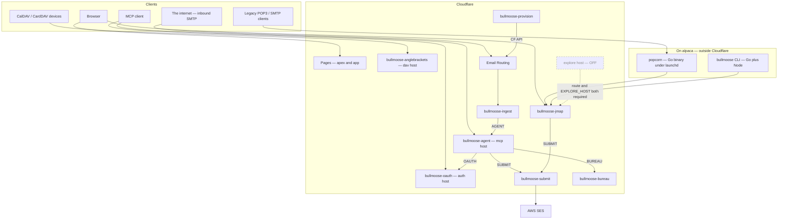
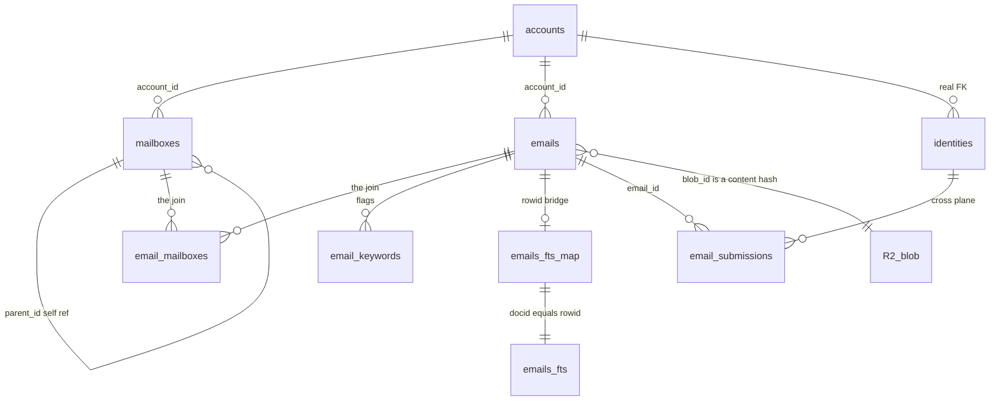
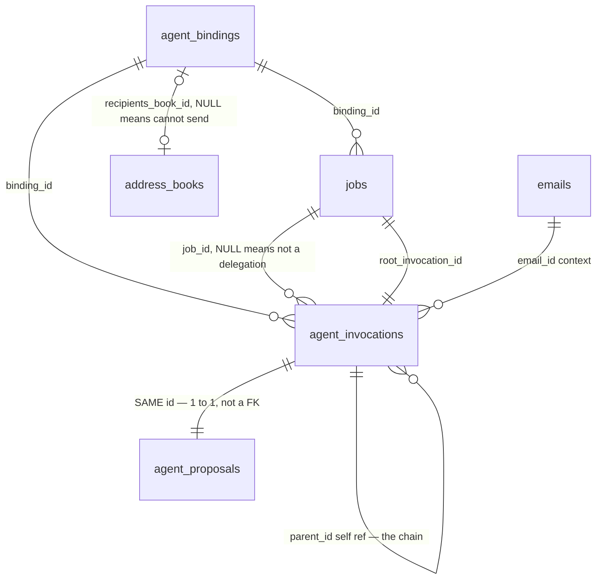
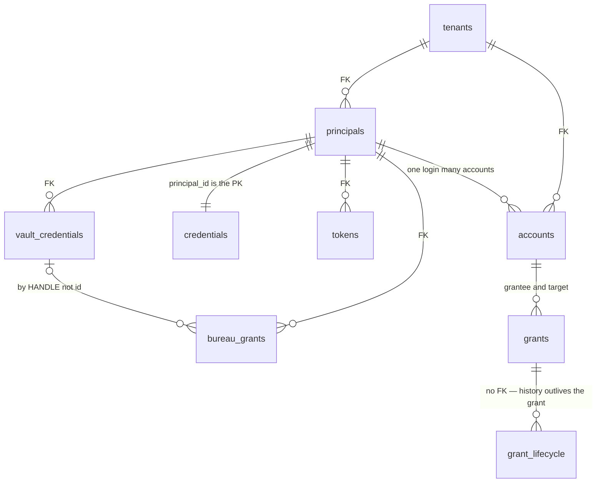
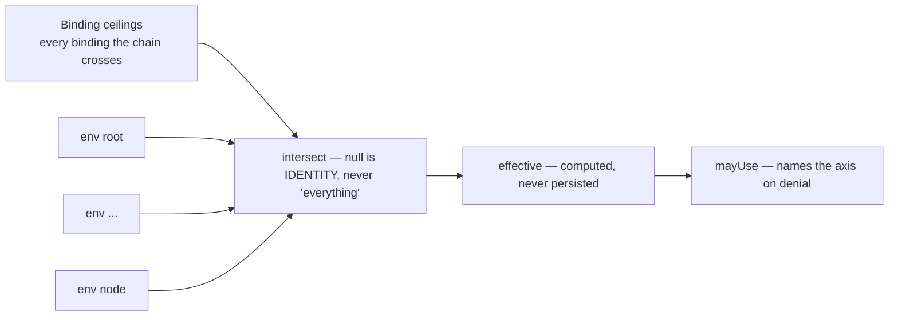
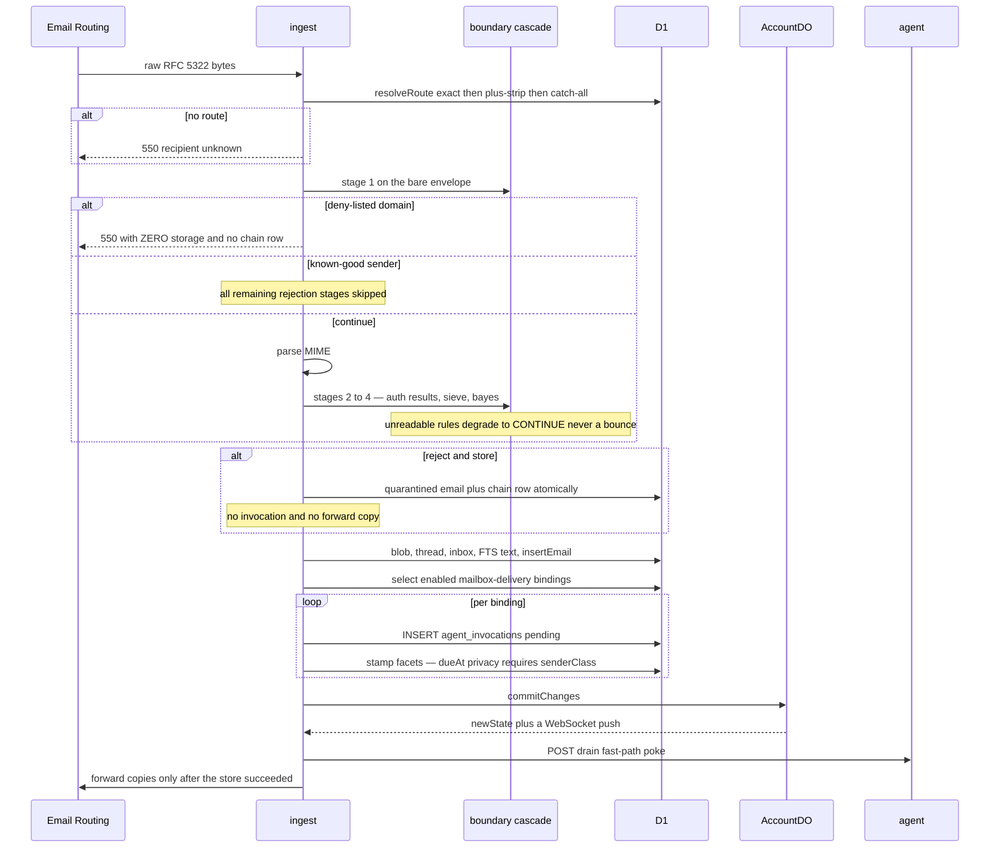
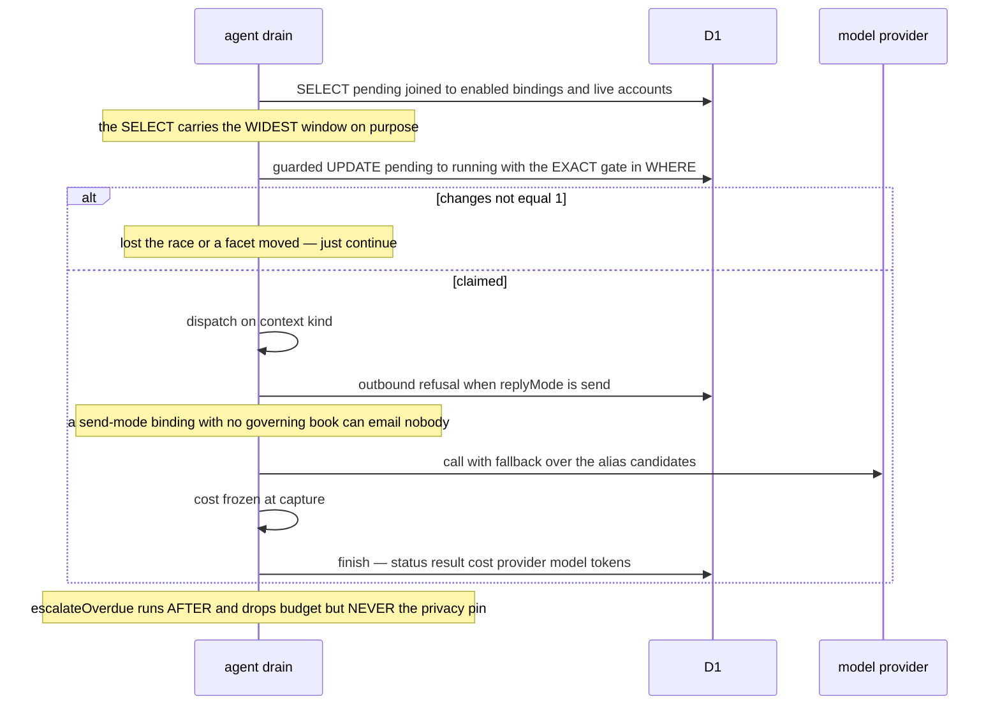
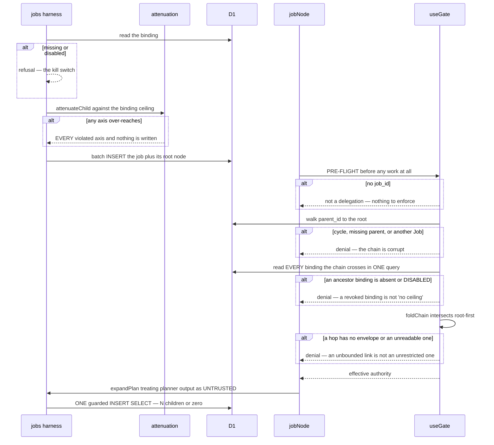
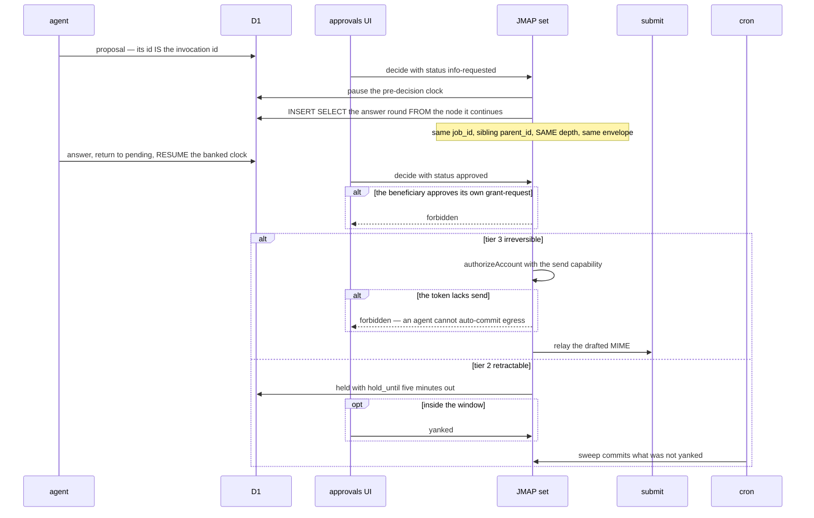
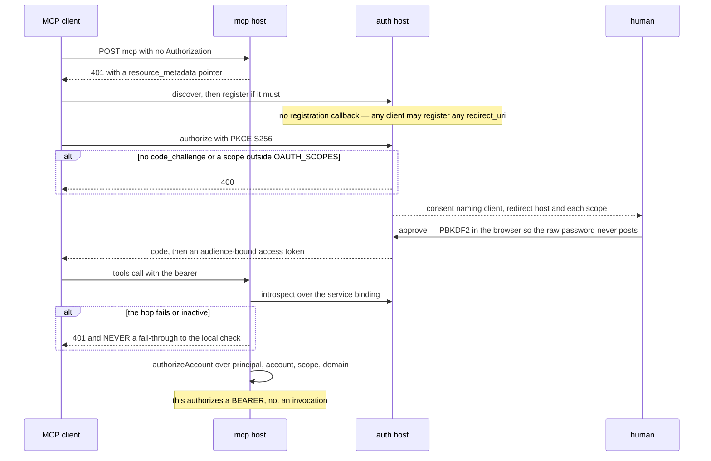

# System map

What bullmoose actually is, as of `b2f0589` — components, data, and the flows
that matter. Every claim here was read out of the code, not out of the other
docs; where the two disagree, §7 says so.

## How to read this

Six facts change the meaning of every diagram below. Read them first or the
pictures will mislead you.

1. **The data plane declares zero foreign keys.** Not "few" — zero. Every
   arrow in §3's mail and agent diagrams is convention enforced in application
   code on `(account_id, id)`. The control plane declares 15, all into
   `tenants`/`principals`/`accounts`/`domains`.
2. **Control plane and data plane are one D1 database today.** Two schema
   files, one database (`infra/bootstrap.mjs:42`). `accounts.shard` is the seam
   where that stops being true. Cross-plane joins work only because of that
   collocation.
3. **Effective authority is computed, never stored.** There is no
   `effective_authority` column and adding one would be the bug. See §4.
4. **`NULL` means four different things** and three of them are the _strict_
   reading. See §5, item "they read NULL as unrestricted".
5. **Schema files never upgrade an existing database.** They are
   `CREATE TABLE IF NOT EXISTS` throughout, so a column added later reaches a
   live shard only via `infra/migrations.mjs` — 30 entries, of which **14 are
   `blocks: "deploy"`**. Deploying a worker ahead of those fails every claim,
   or authenticates nobody, rather than degrading one route.
6. **Some of what is drawn is off.** The explorer and demo-keys are drawn
   dashed. Off means off — see §2's note on the explorer's three independent
   switches.

---

## 1. The shape in one picture



**popcorn is not a Worker.** It is a Go binary under launchd on the house
machine, reaching JMAP over the network like any other client. It is drawn
inside no Cloudflare boundary on purpose.

---

## 2. Components

| Unit                      | Kind             | Surface                                                                                 | Live?                |
| ------------------------- | ---------------- | --------------------------------------------------------------------------------------- | -------------------- |
| `bullmoose-jmap`          | Worker           | `app.bullmoose.cc` — `/api/*`, `/auth/*`, `/console/*`, `/share/*`, `/.well-known/jmap` | yes                  |
| `bullmoose-oauth`         | Worker           | `auth.bullmoose.cc`                                                                     | yes — **but see §7** |
| `bullmoose-agent`         | Worker           | `mcp.bullmoose.cc`, cron `*/5`                                                          | yes                  |
| `bullmoose-ingest`        | Worker           | no route — Email Routing target, cron `17 * * * *`                                      | yes                  |
| `bullmoose-anglebrackets` | Worker           | `dav.bullmoose.cc` — CalDAV/CardDAV                                                     | yes                  |
| `bullmoose-submit`        | Worker           | no route — reached only via `SUBMIT`                                                    | yes                  |
| `bullmoose-bureau`        | Worker           | no route — reached only via `BUREAU`                                                    | yes                  |
| `bullmoose-provision`     | Worker           | `*.workers.dev`, admin bearer                                                           | yes                  |
| `bullmoose-demo-keys`     | Worker           | routes commented out; KV id is a placeholder                                            | **off**              |
| explorer (s21)            | code inside jmap | `explore.bullmoose.cc`                                                                  | **off ×3**           |
| Pages ×2                  | Pages            | apex + `app.bullmoose.cc`                                                               | yes                  |
| `packages/popcorn`        | Go binary        | POP3S; SMTP only if `POPCORN_SMTP_LISTEN`                                               | local                |
| `cli-go`, `packages/cli`  | binaries         | —                                                                                       | local                |
| `packages/*` (10 others)  | TS libraries     | —                                                                                       | library              |

### Shared state is where the coupling actually lives

Eight workers hold the **same** D1 (`bullmoose-mail-shard0` — literally the same
id string in eight configs), five share the R2 bucket, five share the `ROUTES`
KV, and four bind the same `AccountDO` cross-script. The service bindings above
are the visible edges; this is the invisible one.

Three things are deliberately **not** shared, and each is a security boundary:

- **`VAULT_MASTER_KEY` is bound to `bullmoose-bureau` and nowhere else.** Bureau
  holds D1 and nothing else — no R2, no KV, no DO, no AI. A diagram that draws
  bureau with the shared buckets is drawing the thing the service exists to
  prevent.
- **`OAUTH_KV` is bound to the oauth worker only.** The agent worker — which
  runs every MCP tool and reads untrusted email — asks rather than holds.
- **`submit` has no `ACCOUNT_DO` binding** because jmap binds submit; a DO
  binding back would make the pair circular.

### The explorer is off three times over

Uncommenting the route is not enough. `EXPLORE_HOST` is a **secret**, not a var,
precisely so the switch can never be committed; with it unset no explorer code
is reachable whatever the route says. And there is no DNS record — a proxied
`AAAA` to `100::` was chosen over a CNAME specifically so a missing route has no
origin to fall through to. Fails closed, three ways.

---

## 3. Data model

### Mail core



**There is no `threads` table and no `blobs` table.** Threads are
`emails.thread_id` folded at read time — which is why `Thread/changes` honestly
answers `cannotCalculateChanges` rather than faking an empty delta. Blobs are R2
objects keyed by content hash, referenced from three directions and deletable
only through the one route that checks all three pins.

`VacationResponse` is a facade over `responders WHERE kind='vacation'` with a
singleton id. `emails_fts` is contentless FTS5, so you cannot join it to
`emails` directly — `emails_fts_map.docid` is `AUTOINCREMENT` and that is
load-bearing: a reused rowid would attach one message's index to another's id.

### Agent plane



The self-reference on `parent_id` is the attenuation chain. Note it is **not**
execution ordering — that is `needs_json`, a separate relation naming sibling
ids, and children explicitly do not `need` their parent.

`jobs` has **no status column**: status is derived over the node rows, because
materializing it would drift the first time a runner died mid-claim.

### Identity and credentials



Effective rights on an account are **token scopes ∩ grant scopes**.
`bureau_grants` joins `vault_credentials` by _public handle_, not row id, so
rotating a credential keeps the grant.

**There is no `oauth_clients` table.** Client registrations, authorization
codes, tokens and grants all live in `OAUTH_KV`, owned by the provider library.
`oauth_consents` in D1 is a human-readable mirror that is **never consulted to
authorize**.

### Not relational

`ROUTES` KV carries mail routes (no D1 fallback — the KV _is_ the lookup),
share-link records, login throttles, explorer PKCE state, bounce suppression and
the boundary bloom filter. R2 carries every blob under
`mail/{tenant}/{account}/blobs/{blobId}`, with **no GC sweep**. `AccountDO` — one
per account — holds the JMAP change log and _is_ the sync state, bounded to a
4096-entry window, which is why `/changes` returns 409 outside it.

---

## 4. Authority — the thing ER cannot draw

`agent_bindings.config_json.jobs` (the binding ceiling) and
`agent_invocations.authority_json` (the per-node envelope) are both stored. What
governs an action is **neither**:

```
effective(node) = (⋂ bindings the chain crosses) ∩ env(root) ∩ … ∩ env(node)
```

recomputed from the rows on every call. That is what makes narrowing a binding
bite work _already in the queue_, and what makes a hand-edited `authority_json`
unable to widen anything.



Every "cannot read" answer is **no**: a missing parent, a cycle, a graft onto
another Job, a destroyed or disabled ancestor binding, and an absent or
unparseable envelope all deny the whole fold rather than contributing "no
ceiling". One asymmetry is deliberate — a _corrupt_ `config_json` reads as
unset, because anyone who can corrupt that column can rewrite it wider instead.

**Partly closed as of #143.** `bmi_` per-invocation tokens now let MCP name the
invocation, so `tools/list` and `tools/call` are gated by the fold — **for Job
nodes**. An ordinary invocation has no `job_id`, so its envelope is all-`null`
and the tool axis stays unbounded; what a `bmi_` token narrows there is the
account, the realm, the verbs and the lifetime. The Bureau's
`resolveBureauGrant` and `AgentInvocation/set create` are still bearer-only.
`.plans/s17-chief-of-staff/per-invocation-tokens.md` tracks the rest — and note
the whole mechanism stays **voluntary** until its step (d) lands.

---

## 5. Sequences

### Inbound mail → stored → invocation

The cascade is cost-ordered, and it fails open in one direction and closed in
the other **on purpose**. Stage 1 runs on the bare SMTP envelope before the MIME
parse, so a deny-listed domain is refused having stored nothing. Everything past
it that rejects is _stored anyway_ in a quarantine mailbox with a chain row,
never deleted. Every D1 read the cascade adds is wrapped: an unreadable ruleset,
a missing `bayes_state` or a shard predating the s12 migrations degrades to
ordinary inbox delivery. The deny tiers are deny-only, so failing open is an
availability bruise and can never leak mail.



### Claim → run → finish

The load-bearing detail: **the eligibility gate is folded into the claim
`UPDATE`'s `WHERE`, not just the `SELECT`**. The `SELECT` uses the widest
window so a head-of-queue run cannot starve an eligible row; the `UPDATE`
re-evaluates the exact predicate, so nothing landing in between lets the paid
cloud claim outside its set. It is atomic-on-race because `status = 'pending'`
is in that same `WHERE` — two runtimes produce one winner and one no-op.



### Delegation and the fold

Authority is checked **twice, on different sides**. `attenuateChild` refuses on
the _write_ side when a plan over-reaches — returning every violated axis, not
the first. `effectiveNodeAuthority` recomputes the ceiling from the rows on the
_use_ side, because a capability checked only at issue is one the holder keeps
forever.



### Human approval

Two things to watch. **The capability wall**: approving a tier-3 proposal reuses
the exact `send` gate the real send path uses, and _no tool anywhere declares
the `send` scope_, so an agent token structurally cannot auto-commit irreversible
egress. And **the needsInfo round is a continuation, not a re-delegation** — minted
`INSERT … SELECT` from the node it continues, copying `job_id`, `parent_id`,
`depth` and `authority_json`. Same parent makes it the node's _sibling_, so the
chain above is identical and the fold collapses to exactly `effective(node)`;
copying `depth` rather than incrementing means N questions cannot buy N levels
of `maxDepth`.



### OAuth and MCP

Wall-clock order starts with a **refusal**: an unauthenticated `POST /mcp`
returns 401 whose `WWW-Authenticate` carries an RFC 9728 pointer, which is how a
client with no credential learns where the AS is. The introspection hop **must
not fall through** to the local token check on failure — an AS outage becoming an
authorization bypass is the classic fail-open bug, and the call site says so.



---

## 6. What a newcomer gets wrong

**They trust the arrows.** The data plane has no foreign keys at all. Every
relation in §3's first two diagrams is application-enforced convention.

**They look for `agent_proposals.invocation_id`.** There isn't one — the
proposal's primary key _is_ the invocation's. That is deliberate: the proposal
cannot contradict the invocation because it doesn't store its state. This
mistake has a scar in the tree — the needsInfo round once copied `binding_id`
and nothing else, silently turning a narrowed delegated node into an ungated
ordinary one, because `job_id IS NULL` is how the gate is told "no delegation".

**They read `NULL` as "unrestricted".** It means four things and three are the
strict reading: `recipients_book_id IS NULL` means _cannot send_;
`authority_json IS NULL` inside a Job means _deny the fold_; `cost_micros IS
NULL` means _unknown_, not free. Only `job_id IS NULL` is permissive, and only
because it means the machinery was never engaged.

**They look for the effective-authority column.** See §4. Adding one is the bug.

**They assume the schema files are the schema.** They are idempotent for
creating and silently decline to upgrade. Twelve columns arrive only via
migrations.

**They assume two planes means two databases.** One D1 today.
`accounts.shard` is the seam where that changes.

---

## 7. Known drift — where the code and the docs disagree

Found while writing this. All verified. Struck-through rows have since been
fixed; they stay listed because knowing a thing _was_ wrong is how you know
to check whether anything downstream still assumes it.

| #   | Drift                                                                                                                                                                                                                                      | Consequence                                                                                                                                                                                                                                                                                                                                                                                                                                                                                                               |
| --- | ------------------------------------------------------------------------------------------------------------------------------------------------------------------------------------------------------------------------------------------ | ------------------------------------------------------------------------------------------------------------------------------------------------------------------------------------------------------------------------------------------------------------------------------------------------------------------------------------------------------------------------------------------------------------------------------------------------------------------------------------------------------------------------- |
| 1   | ~~`services/oauth` is in no CI workflow~~ — **fixed in #145**                                                                                                                                                                              | Was: `infra/bootstrap.mjs:76` deployed eight workers including it while `deploy-mail.yml` had seven steps and no oauth step, so nine commits' worth of AS changes — the whole s02 arc, including token revocation — merged without CI ever deploying them. Now `deploy-mail.yml` has a "Deploy oauth" step, ordered _before_ agent because `services/agent/wrangler.jsonc:50` binds it                                                                                                                                    |
| 2   | ~~`PUBLIC_SCOPES` (6) ⊂ `OAUTH_SCOPES` (9)~~ — **fixed in #144**                                                                                                                                                                           | Was: MCP advertised neither `files`, `delete` nor `mail`, so an agent reading the metadata could not learn the files realm existed. Now derived from `OAUTH_SCOPES` minus a deny list that carries its reasons, with a drift test that also fails on a _stale_ exemption                                                                                                                                                                                                                                                  |
| 3   | ~~`actionProposal.ts:892` calls the `reply-draft` apply "tier 3, human-approved"~~ — **fixed in #148**                                                                                                                                     | Was: its only producer emits **tier 2** (`services/agent/src/proposals.ts:141`), so an approve never reaches `applyProposal` directly — it parks in the hold tray and arrives via `commitDueHeldProposals`. The comment now says that, and says why the tier-3 wall is kept anyway: it is real and tested (`actionProposal.test.ts:237`) but guards a branch nothing produces, and a reader learning only the second half would delete it as dead code. See row 7 for the copy of this claim that is _not_ just a comment |
| 4   | ~~`/console/*` is a real jmap route, omitted from `deploy-app.yml:7` and from `wrangler.jsonc:8`'s "these four patterns" (there are five)~~ — **fixed in #148**                                                                            | Was: provisioning routes from either comment lost the agent console to a Pages 404. Both enumerations now list all five, and `wrangler.jsonc` says "five"                                                                                                                                                                                                                                                                                                                                                                 |
| 5   | popcorn's committed plist sets `POPCORN_LISTEN` only                                                                                                                                                                                       | The SMTP face is conditional on `POPCORN_SMTP_LISTEN`, which the plist never sets. Any SMTP submission is runtime config living outside this repo                                                                                                                                                                                                                                                                                                                                                                         |
| 6   | ~~`services/jmap/wrangler.jsonc:142` refers to "services/auth"~~ — **fixed in #148**                                                                                                                                                       | Was: no such directory. The AS is `services/oauth` (worker `bullmoose-oauth`), served at `auth.bullmoose.cc` — hostname and directory do not match, which is what made it read as a missing component, so the comment now says so. It also called the AS "OIDC"; it is OAuth 2.1 (`services/oauth/src/index.ts:11`)                                                                                                                                                                                                       |
| 7   | **The tier-3 claim in row 3 has a second, load-bearing copy.** `services/provision/src/index.ts:1917` also states "A `reply-draft` is tier 3" — and there it is the stated _reason_ `SUPERVISORY_GRANT_SCOPES` includes `send` (line 1934) | reply-draft is tier 2, so the capability wall never fires for it and `send` is currently unjustified by its own argument — while being a real widening: the owner gets send on the agent's account. Unlike row 3 this is not a comment fix. Either `send` stays for a future tier-3 kind and the comment must say _that_, or the grant narrows to `read`+`draft`. Needs a decision                                                                                                                                        |
| 8   | Demo mode teaches the wrong tier. `webmail/src/lib/approvals/demoApprovals.ts:188,362` ship `reply-draft` fixtures at `tier: 3` (the one at :115 is tier 2), and the comment at :183-184 cites `actionProposal.ts:424-427`                 | That line range is stale too — the case is at :892. The demo is the first thing a newcomer sees, and two thirds of its reply-drafts contradict the only real producer                                                                                                                                                                                                                                                                                                                                                     |
