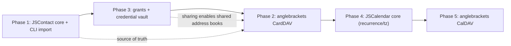

# Dev plan handoff — personal-data + delegation layer

**Purpose.** This doc is a self-contained handoff so a *fresh context
window* can execute the next workstream without re-deriving decisions.
It records the locked decisions, the phased plan, the cross-cutting
design, and what's explicitly deferred. Design *rationale* lives in
`architecture/capability-roadmap.md`; this is the *execution* plan.

Read first: this doc, then `architecture/capability-roadmap.md`
(the WHY), then `architecture/README.md` (system map). Current
production state is in §2.

---

## 1. What this workstream delivers

The mail platform is live (§2). This workstream adds the **personal-data
core (contacts, then calendar), a native-app sync face (CalDAV/CardDAV),
and the grants + credentials subsystem** that lets agents act across your
data and lets you share data with family.

Guiding goal, in one line: **your contacts and calendar live in
bullmoose as the single source of truth, agents use them with zero
external dependency, and the same data shows up in your native apps and
(optionally) shared with family.**

---

## 2. Where the platform is today (grounding for a fresh context)

Live on the Cloudflare **free tier**, five workers
(`bullmoose-{jmap,ingest,submit,provision,agent}.eric-d-moore.workers.dev`),
`jmap.bullmoose.cc` custom domain:

- **Core**: D1 `bullmoose-mail-shard0`, R2 `bullmoose-mail-blobs`, KV
  routes/suppression. **AccountDO** = single-writer per account with a
  **collection-agnostic changelog** (already carries `Email`, `Mailbox`,
  `AgentInvocation`), a monotonic state sequence, hibernatable WebSocket
  push, and alarms (armed responders).
- **Mail**: full JMAP mail surface; **popcorn** (Go daemon on alpaca,
  tailnet, real TLS) serves POP3S :9995 + SMTPS :9587 translating to
  JMAP; deliver-and-forward; `_jmap._tcp` SRV autodiscovery.
- **Auth**: `bm_<id>_<secret>` bearer tokens that double as HTTP-Basic
  app-passwords (JMAP / POP3 / SMTP); client-side PBKDF2 (600k) login
  keys (the 10ms Worker CPU cap lives here).
- **Agents**: cloud `agent` worker with **reply** (EditorEmily /
  `editor@`) and **ledger** (Allen / `analyst@`) pipelines, front-matter
  model selection, models.dev pricing; homelab **hermes@** bridge
  (`watch → hermes -z → popcorn SMTP`, 45s watchdog, launchd).
- **Docs**: `docs/README.md` (use-case cookbook), `docs/agents/README.md`,
  `docs/architecture/{README,serverless-jmap,agent-integration,capability-roadmap}.md`,
  `docs/examples/`. Memory: `~/.claude/.../memory/`.
- **Caveat**: SES is **sandboxed** — outbound only to verified recipients
  until production access is granted.

**Key reuse fact:** the AccountDO changelog is already collection-agnostic,
so `Contact`/`CalendarEvent` become new collections with *no new DO state
machinery* — the same commit/`/changes`/push path mail uses.

---

## 3. Locked decisions

| # | decision | ruling |
|---|---|---|
| Storage | JSON blob (lossless source of truth) **+** only the indexed columns needed for queries now (uid, updated, addressBookId; events: start/end). More extracted columns later = free backfill, not a migration. | **hybrid** |
| Recurrence | store master + recurrence rule; **expand on demand** within a bounded window (cap the pre-compute). Lives entirely in the calendar phase. | on-demand, capped |
| Convergence (Q1) | the bullmoose core is the **destination / source of truth**. Agents use it natively — **zero Google dependency**. External MCP (Google, …) is an *optional connector, never required*. Import is how the destination gets populated (see §6, §7). | **destination** |
| Grants + creds (Q2) | build the grant model **and** the credential subsystem **correctly, no shortcut** — this is open source and must be internally consistent / correct-by-construction. Sharing (family) and delegation both depend on it. | **build it right** |
| Multi-tenant (Q3) | **schema stays multi-tenant** (already keyed by account/tenant — one column, free); *management/ops surfaces* stay single-user for now. | multi-tenant schema, single-user ops |
| DAV scope (Q4) | implement the **minimal WebDAV verb subset** CalDAV/CardDAV need (`PROPFIND`/`REPORT`/`PUT`/`GET`/`DELETE` + ETags + ctag + `.well-known`); **skip** LOCK/UNLOCK, COPY/MOVE, free/busy, and scheduling inbox-outbox (iTIP/iMIP). Concurrency via **ETags** in v1; **CRDTs are the target for shared multi-writer collections** (§7). | barely-conforming |
| ctag / sync-token (§5 prior) | **sync-token backbone = the DO global state sequence** (filter changelog results per collection); **ctag = a per-collection counter** bumped on member change (keeps idle polls silent). Bake `addressBookId`/`calendarId` + collection `ctag` into the schema day one. | locked |

Principles that follow: **one source of truth**, **correct-by-construction**,
**no external dependency for core function**, **reuse the existing DO /
changelog / auth rather than parallel machinery**.

---

## 4. Standards reference

| layer | contacts | calendar |
|---|---|---|
| JSON format | JSContact — RFC 9553 | JSCalendar — RFC 8984 |
| JMAP methods | JMAP for Contacts — RFC 9610 (published) | JMAP for Calendars — draft-ietf-jmap-calendars |
| DAV wire format | vCard — RFC 6350 | iCalendar — RFC 5545 |
| DAV protocol | CardDAV — RFC 6352 (over WebDAV RFC 4918) | CalDAV — RFC 4791 |
| translation | JSContact↔vCard — RFC 9555 | JSCalendar↔iCalendar — draft-ietf-calext-jscalendar-icalendar |

Contacts is a finished RFC; calendar is still a draft — the IETF shipped
contacts first *because calendar is harder* (recurrence/timezones/
scheduling). We follow the same order.

---

## 5. Phases (execution order: 1 → 3 → 2 → 4 → 5)



Why **3 before 2**: grants land before the native sync face, so when
CardDAV ships, *sharing already exists* — the family shared-address-book
(caroline@) works through CardDAV from day one of Phase 2.

### Phase 1 — JSContact-on-JMAP core + CLI import
- **Data model** (data-plane.sql): `address_books` (id, account_id, name,
  description, sort_order, is_default, **ctag** counter, shareWith later,
  timestamps) and `contact_cards` (id, account_id, **address_book_id**
  indexed, uid, **card_json** = JSContact blob source of truth, extracted
  `name_full`/`updated_at` indexed, timestamps). Single addressbook per
  card in v1 (matches CardDAV; store full `addressBookIds` in the blob;
  junction later if ever needed).
- **JMAP methods** (`services/jmap/src/methods/contacts.ts`):
  `AddressBook/get·set·changes`, `ContactCard/get·set·query·changes`.
  Capability `urn:ietf:params:jmap:contacts` in jmap-core.
- **Commits** route through the DO with collections `AddressBook` /
  `ContactCard`; bump the addressbook `ctag` on any member change.
- **CLI import (convergence/bootstrap):** `bullmoose contacts import
  <file.vcf>` → parse vCard → `ContactCard/set`. This is *how the
  destination gets populated* and the first step of the "bundle up
  on-disk data" idea (§7). Also add read/list for verification.
- **Verify**: e2e against the deployed worker (create addressbook, import
  vCards, query, `/changes` delta) — pattern of `tools/e2e-jmap.mjs`.

### Phase 3 — Grants + credential subsystem (built correctly)
- **Grant model**: `agent_grants` (grantee_account_id,
  target_account_id, scopes ⊆ read/query/annotate/draft, created_by,
  expires_at?, audit). Owner-minted only (`bullmoose admin grant …`).
  Runtime resolves grants → tools operate on the *target's* store,
  scope-filtered; every cross-account access is audited.
- **Sharing** = the same primitive surfaced on collections: JMAP Contacts
  `AddressBook.shareWith`/`myRights` (RFC 9610) backed by grants → this is
  the caroline@ shared-contact-list mechanism (§7).
- **Credential vault (correct, per Q2)**: per-principal, envelope-
  encrypted (WebCrypto AES-GCM, master key = `agent`-worker secret),
  **write-only** API (never return a stored secret), two shapes
  (API-key + OAuth refresh-token). Keyed by principal.
- **bullmoose's own MCP servers**: a read-only **mailstore-analytics**
  MCP (bounded queries over the message log) authenticated by the
  internal token — this is Benedict-lite's safe tool surface, *no
  external creds needed*.
- **External MCP** is an optional connector on top of the vault; the CLI
  runs the OAuth browser+localhost-callback flow and uploads the
  refresh token (CLI is the conduit, the cloud stores it).
- **Access path**: agent → grant → account's connection/collection →
  (internal tool | external public API).

### Phase 2 — anglebrackets CardDAV (native contact sync)
- New **stateless HTTP worker** `anglebrackets` (binds AccountDO
  cross-script, D1, R2 — structurally the jmap worker wearing DAV).
- Minimal WebDAV subset: `.well-known/carddav` → principal discovery →
  `PROPFIND` (collections), `REPORT` (`sync-collection` + `addressbook-
  query` + `addressbook-multiget`), `PUT`/`GET`/`DELETE`. **ETags** for
  concurrency; **ctag** + **sync-token** map to the per-collection
  counter + DO state (§3). vCard serialization via JSContact↔vCard
  (RFC 9555). App-password Basic auth (same as popcorn).
- Shared address books (Phase 3) appear here automatically.
- **Verify against real Apple Contacts** (fussy client — budget a
  testing loop, not just spec-reading).

### Phase 4 — JSCalendar-on-JMAP core
- `calendars` + `calendar_events` (JSCalendar blob + indexed
  start/end/calendar_id/updated + per-calendar ctag). JMAP
  `Calendar/*`, `CalendarEvent/*`.
- **The recurrence/timezone work lands here** (the concentrated risk):
  store rule, expand-on-demand capped for time-range queries; IANA TZ.
- **Convergence decision to finalize here**: agents migrate off any
  Google usage onto this core so the native view and the agent act on
  one dataset (this is the payoff of Q1).

### Phase 5 — anglebrackets CalDAV (native calendar sync)
- Add CalDAV to the anglebrackets worker: `.well-known/caldav`,
  `calendar-query`/`calendar-multiget` REPORTs (time-range → the
  recurrence expander), iCalendar via JSCalendar↔iCalendar.
- Skip scheduling/free-busy/locking (Q4).
- Verify against Apple Calendar.

---

## 6. Cross-cutting design notes

- **Storage pattern** mirrors email exactly: raw/JSON blob = source of
  truth, extracted indexed columns for querying. Never lose data to the
  column model.
- **ctag vs sync-token** (why it's cost-critical): native DAV clients
  **poll** (no push). A ctag check makes an idle poll O(1) ("unchanged →
  stop"); only a changed ctag triggers a `sync-collection` returning
  O(delta). Without it, every poll is O(N) `PROPFIND` over all items —
  which on the free tier's 5M D1-reads/day is fatal at a few thousand
  items × devices × polls. We already own the delta machinery (DO
  `/changes`); the schema just needs `addressBookId`/`calendarId` +
  per-collection ctag.
- **Concurrency**: ETag optimistic (`If-Match`) — what DAV clients
  expect. CRDTs are **not** v1; they're the target for shared multi-
  writer collections (§7).
- **anglebrackets is stateless**: no sessions, no locks; ETags +
  sync-token carry all the state, which lives in the core.

---

## 7. Deferred / future (captured so it isn't lost)

- **CLI data-bundling bootstrap.** Extend Phase 1's import: the CLI can
  package on-disk data from a native app (macOS Contacts export / the
  AddressBook store / `.vcf` / `.ics`) into a **bootstrap bundle** and
  load it — the same spirit as the existing `init --url file://` bundle
  path. This is the natural way to seed the destination core from what
  you already have. Worth a `bullmoose contacts import` in Phase 1 and a
  richer `bundle` later.
- **Family sharing (caroline@).** A shared contact list between, e.g.,
  `eric@` and a future `caroline@`, synced to *both* households' native
  apps. Mechanism: a shared `AddressBook` (JMAP `shareWith`/`myRights`
  backed by the Phase-3 grant model) surfaced through CardDAV. This is a
  **native-apps context** and a **multi-writer** one — which is exactly
  where **CRDTs** earn their keep (offline edits on two devices merging
  without a lock). v1: ETag concurrency + last-writer-wins on the shared
  book; **explore CRDTs for conflict-free shared-collection merge** as
  the real solution. This use case is *the* reason the grant model is
  built correctly in Phase 3.
- **Per-principal external OAuth at scale** — the vault is built in
  Phase 3; multi-user onboarding UX (hosted consent flow, per-user
  quotas) is later.
- **Calendar scheduling** (iTIP/iMIP invites/RSVPs, free/busy) — skipped
  in v1; revisit if you want server-side meeting invitations.
- **Agentic code sandbox** — from capability-roadmap §6; gated hardest
  (arbitrary execution over untrusted content), unchanged.

---

## 8. Conventions for the executing context

- **Commit straight to `main`** (no branches unless parallel agents);
  end commit messages with the Co-Authored-By + Claude-Session trailers
  used throughout the history.
- **Validate every mermaid diagram** by rendering with mermaid-cli
  before committing docs (harness used this run:
  `@mermaid-js/mermaid-cli`, `mmdc -i block.mmd -o out.svg`). Quote
  labels containing `@` — mermaid treats it as node metadata syntax.
- **Verify by driving the real thing** end-to-end (deploy + e2e against
  the live worker, or a real client) — not just typecheck. Match the
  existing `tools/e2e-*.mjs` pattern.
- **Reuse, don't fork**: the DO changelog, auth tokens, Mailstore
  patterns, and the models.ts model-routing already exist — extend them.
- Production credentials/IDs and the alpaca/hermes/popcorn operational
  state are in the memory files; read them before touching prod.
```
